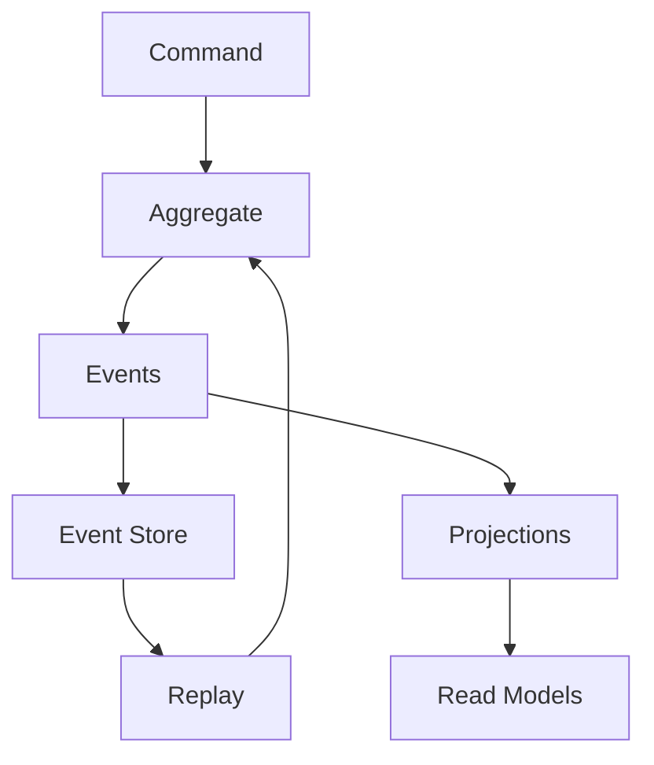

## 🏷️ Tags

#type/moc #concept/event-sourcing #concept/cqrs #concept/ddd #tech/csharp #tech/asp-net #area/architecture #area/data 

---

# ArchPat.Event Sourcing

> [!info] 🎯 О чем эта заметка Центральная заметка (MOC) по Event Sourcing в .NET экосистеме - от базовых концепций до практической реализации

---

## ✅ Что будет раскрыто

- [x] Основные концепции и принципы Event Sourcing
- [x] Архитектурные паттерны и их взаимосвязи
- [x] Практические аспекты реализации в .NET
- [x] Инфраструктурные компоненты и их роли
- [x] Примеры кода и best practices
- [x] Сценарии применения и ограничения
- [x] Интеграция с CQRS и DDD

---

## 📋 Содержание

### 🔍 Основы

- [[Event Sourcing - Концепции|📖 Базовые концепции и принципы]]
- [[Event Sourcing - Архитектура|🏗️ Архитектурные паттерны]]
- [[Event Sourcing vs CRUD|⚖️ Event Sourcing vs традиционные подходы]]

### 🛠️ Практическая реализация

- [[Event Store Implementation|💾 Реализация Event Store]]
- [[Event Sourcing - Агрегаты|🎯 Агрегаты и события]]
- [[Event Sourcing - Проекции|📊 Проекции и Read Models]]
- [[Event Sourcing - Снапшоты|📸 Снапшоты и оптимизация]]

### 🔧 Инфраструктура

- [[Event Sourcing - Версионирование|🔄 Версионирование событий]]
- [[Event Sourcing - Message Bus|📡 Message Bus и интеграция]]
- [[Event Sourcing - Мониторинг|📈 Мониторинг и отладка]]

### 🚀 Продвинутые сценарии

- [[Event Sourcing - Temporal Queries|⏰ Временные запросы]]
- [[Event Sourcing - Саги|🔀 Саги и распределенные транзакции]]
- [[Event Sourcing - Тестирование|🧪 Тестирование Event Sourcing]]

---

## 🚀 Быстрый старт

> [!tip] ⚡ Минимальный пример
> 
> ```csharp
> // Событие
> public record AccountCreated(Guid AccountId, string Owner, decimal InitialBalance);
> 
> // Агрегат
> public class Account : AggregateRoot
> {
>     public Guid Id { get; private set; }
>     public string Owner { get; private set; }
>     public decimal Balance { get; private set; }
>     
>     public static Account Create(string owner, decimal initialBalance)
>     {
>         var account = new Account();
>         account.Apply(new AccountCreated(Guid.NewGuid(), owner, initialBalance));
>         return account;
>     }
>     
>     protected override void When(object @event)
>     {
>         switch (@event)
>         {
>             case AccountCreated e:
>                 Id = e.AccountId;
>                 Owner = e.Owner;
>                 Balance = e.InitialBalance;
>                 break;
>         }
>     }
> }
> ```

---

## 🎯 Ключевые концепции

### 📝 Определение

**Event Sourcing** — архитектурный паттерн, где состояние приложения сохраняется как последовательность событий, а не как снимок текущего состояния.

### 🏛️ Основные принципы

|Принцип|Описание|
|---|---|
|**Immutable Events**|События неизменяемы после записи|
|**Append-Only**|Новые события только добавляются|
|**Event as Source of Truth**|События — единственный источник истины|
|**State Reconstruction**|Состояние восстанавливается из событий|

### 🔄 Архитектурная схема



---

## ✅ Преимущества

> [!success] 🎊 Основные выгоды
> 
> - **Полный аудит** — каждое изменение зафиксировано
> - **Временные запросы** — состояние на любой момент времени
> - **Отладка** — воспроизведение последовательности событий
> - **Масштабируемость чтения** — независимые read models
> - **Гибкость** — новые проекции без миграции данных

---

## ⚠️ Недостатки и ограничения

> [!warning] 🚨 Стоит учесть
> 
> - **Сложность** — требует архитектурной дисциплины
> - **Eventual Consistency** — асинхронность обновления проекций
> - **Storage Overhead** — все события хранятся навсегда
> - **Performance** — восстановление состояния может быть медленным
> - **GDPR Compliance** — сложности с "правом на забвение"

---

## 🛠️ Популярные библиотеки .NET

|Библиотека|Описание|Уровень|
|---|---|---|
|**EventStore**|Специализированная БД для событий|Enterprise|
|**Marten**|PostgreSQL как Event Store|Production|
|**NEventStore**|.NET библиотека для различных БД|Community|
|**Eventuous**|Современный фреймворк для ES|Modern|
|**SqlStreamStore**|SQL-based event store|Lightweight|

---

## 🎯 Когда использовать

### ✅ Подходящие сценарии

- Системы с высокими требованиями к аудиту
- Финансовые приложения
- Системы с сложной бизнес-логикой
- Необходимость анализа исторических данных
- Микросервисы с четкими границами

### ❌ Не подходит для

- CRUD-приложения без сложной логики
- Системы с простой структурой данных
- Проекты с жесткими требованиями к консистентности
- Команды без опыта работы с сложной архитектурой

---

## 🔗 Связанные концепции

- [[MOC - ArchPat - CQRS|CQRS]]
- [[DDD.Aggregate|DDD - Aggregate]]
- [[Arch.Event-Driven|📡 Событийно-ориентированная архитектура]]
- [[Eventual Consistency|⏳ Конечная согласованность]]
- [[Domain Events|📬 Доменные события]]

---

## 📚 Дополнительные ресурсы

### 📖 Рекомендуемые материалы

- **Greg Young** - "Event Sourcing" (основоположник концепции)
- **Martin Fowler** - "Event Sourcing" статья
- **"Implementing Domain-Driven Design"** by Vaughn Vernon
- **"Building Event-Driven Microservices"** by Adam Bellemare

### 🎥 Видео и курсы

- Pluralsight: "Event Sourcing in .NET"
- YouTube: Greg Young's Event Sourcing talks
- NDC Conferences: Event Sourcing presentations

---

> [!quote] 💡 Помни "Event Sourcing - это не серебряная пуля, но мощный инструмент для правильных задач. Начни с понимания доменной модели, а затем решай, нужен ли тебе ES." - Greg Young