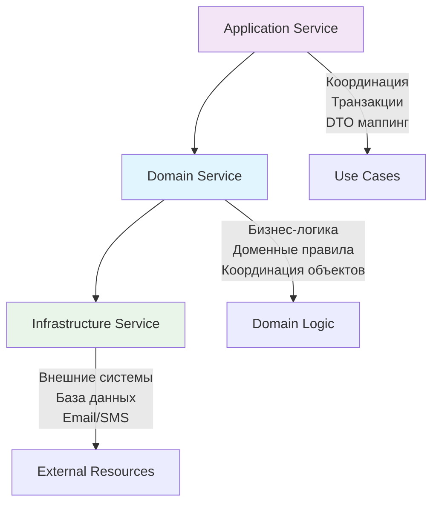

## 🏷️ Tags

#type/permanent #concept/ddd #ddd/aggregate #ddd/domain-service #ddd/value-object #ddd/entity #area/architecture #area/development 

---

# DDD.Domain Service

> [!info] 📋 О заметке Подробное руководство по Domain Service в DDD - когда использовать, как проектировать и реализовывать доменные сервисы для сложной бизнес-логики

---

## ✅ Что будет раскрыто

- [x] Определение и назначение Domain Service
- [x] Критерии выделения доменной логики в сервис
- [x] Отличия от Application Service и Infrastructure Service
- [x] Паттерны проектирования и best practices
- [x] Примеры реализации на C#
- [x] Интеграция с Aggregate и Entity
- [x] Типичные ошибки и как их избежать

---

## 📑 Содержание

1. [Определение Domain Service](https://claude.ai/chat/18d22bbd-47cb-4b27-962b-f0ed3c5ef10f#%D0%BE%D0%BF%D1%80%D0%B5%D0%B4%D0%B5%D0%BB%D0%B5%D0%BD%D0%B8%D0%B5-domain-service)
2. [Когда использовать](https://claude.ai/chat/18d22bbd-47cb-4b27-962b-f0ed3c5ef10f#%D0%BA%D0%BE%D0%B3%D0%B4%D0%B0-%D0%B8%D1%81%D0%BF%D0%BE%D0%BB%D1%8C%D0%B7%D0%BE%D0%B2%D0%B0%D1%82%D1%8C-domain-service)
3. [Отличия от других сервисов](https://claude.ai/chat/18d22bbd-47cb-4b27-962b-f0ed3c5ef10f#%D0%BE%D1%82%D0%BB%D0%B8%D1%87%D0%B8%D1%8F-%D0%BE%D1%82-%D0%B4%D1%80%D1%83%D0%B3%D0%B8%D1%85-%D1%81%D0%B5%D1%80%D0%B2%D0%B8%D1%81%D0%BE%D0%B2)
4. [Проектирование Domain Service](https://claude.ai/chat/18d22bbd-47cb-4b27-962b-f0ed3c5ef10f#%D0%BF%D1%80%D0%BE%D0%B5%D0%BA%D1%82%D0%B8%D1%80%D0%BE%D0%B2%D0%B0%D0%BD%D0%B8%D0%B5-domain-service)
5. [Примеры реализации](https://claude.ai/chat/18d22bbd-47cb-4b27-962b-f0ed3c5ef10f#%D0%BF%D1%80%D0%B8%D0%BC%D0%B5%D1%80%D1%8B-%D1%80%D0%B5%D0%B0%D0%BB%D0%B8%D0%B7%D0%B0%D1%86%D0%B8%D0%B8)
6. [Best Practices](https://claude.ai/chat/18d22bbd-47cb-4b27-962b-f0ed3c5ef10f#best-practices)
7. [Типичные ошибки](https://claude.ai/chat/18d22bbd-47cb-4b27-962b-f0ed3c5ef10f#%D1%82%D0%B8%D0%BF%D0%B8%D1%87%D0%BD%D1%8B%D0%B5-%D0%BE%D1%88%D0%B8%D0%B1%D0%BA%D0%B8)

---

## 🎯 Определение Domain Service

> [!tip] ✨ Определение **Domain Service** — это сервис, который инкапсулирует доменную логику, которая не принадлежит естественно ни одному [[DDD/ Aggregate|Aggregate]] или [[DDD.Entity|DDD - Entity]], но является частью доменной модели.

### 📋 Ключевые характеристики

|Характеристика|Описание|
|---|---|
|**Stateless**|Не хранит состояние между вызовами|
|**Domain Logic**|Содержит чистую бизнес-логику домена|
|**Координация**|Координирует работу множественных доменных объектов|
|**Immutable Interface**|Интерфейс не изменяется со временем|

---

## 🤔 Когда использовать Domain Service

> [!question] Сигналы для выделения в Domain Service

### 🎯 Основные сценарии

1. **Логика охватывает несколько Aggregates**
    
    ```
    Перевод денег: Account A → Account B
    Расчет скидки: Customer + Order + Catalog
    ```
    
2. **Сложные вычисления без естественного места**
    
    ```
    Алгоритмы ценообразования
    Валидация бизнес-правил
    Расчет налогов
    ```
    
3. **Координация доменных объектов**
    
    ```
    Оркестрация бизнес-процессов
    Применение политик домена
    ```
    

> [!warning] ⚠️ Когда НЕ использовать
> 
> - Простые CRUD операции
> - Логика, которая естественно принадлежит Entity/Aggregate
> - Инфраструктурные операции (email, файлы)

---

## 🔄 Отличия от других сервисов



|Тип сервиса|Назначение|Зависимости|Тестирование|
|---|---|---|---|
|**Domain Service**|Бизнес-логика домена|Только доменные объекты|Unit тесты|
|**Application Service**|Координация use cases|Domain + Infrastructure|Integration тесты|
|**Infrastructure Service**|Внешние ресурсы|Внешние системы|Mock/Stub тесты|

---

## 🛠️ Проектирование Domain Service

### 📐 Принципы проектирования

> [!tip] 🎨 Принципы DDD для сервисов
> 
> 1. **Ubiquitous Language** - название отражает доменную терминологию
> 2. **Single Responsibility** - один четко определенный доменный процесс
> 3. **Dependency Inversion** - зависит только от абстракций
> 4. **Interface Segregation** - компактный, focused интерфейс

### 🏗️ Структура интерфейса

```csharp
// ✅ Правильный Domain Service
public interface ITransferMoneyService
{
    Task<TransferResult> TransferAsync(
        AccountId fromAccountId, 
        AccountId toAccountId, 
        Money amount,
        TransferReason reason);
}

// ✅ Результат операции
public class TransferResult
{
    public bool IsSuccess { get; }
    public TransferId TransferId { get; }
    public IReadOnlyList<DomainEvent> DomainEvents { get; }
    public TransferError? Error { get; }
}
```

---

## 💻 Примеры реализации

### 🏦 Пример 1: Сервис перевода денег

```csharp
public class TransferMoneyService : ITransferMoneyService
{
    private readonly IAccountRepository _accountRepository;
    private readonly ITransferPolicyService _transferPolicy;

    public TransferMoneyService(
        IAccountRepository accountRepository,
        ITransferPolicyService transferPolicy)
    {
        _accountRepository = accountRepository;
        _transferPolicy = transferPolicy;
    }

    public async Task<TransferResult> TransferAsync(
        AccountId fromAccountId, 
        AccountId toAccountId, 
        Money amount,
        TransferReason reason)
    {
        // 1. Загружаем агрегаты
        var fromAccount = await _accountRepository.GetByIdAsync(fromAccountId);
        var toAccount = await _accountRepository.GetByIdAsync(toAccountId);

        if (fromAccount == null || toAccount == null)
            return TransferResult.AccountNotFound();

        // 2. Применяем доменные политики
        var policyResult = await _transferPolicy.ValidateTransferAsync(
            fromAccount, toAccount, amount, reason);
        
        if (!policyResult.IsValid)
            return TransferResult.PolicyViolation(policyResult.Violations);

        // 3. Выполняем доменную операцию
        var withdrawResult = fromAccount.Withdraw(amount, reason);
        if (!withdrawResult.IsSuccess)
            return TransferResult.InsufficientFunds();

        var depositResult = toAccount.Deposit(amount, reason);
        if (!depositResult.IsSuccess)
        {
            // Компенсационная транзакция
            fromAccount.Deposit(amount, TransferReason.Compensation);
            return TransferResult.DepositFailed();
        }

        // 4. Создаем доменное событие
        var transferEvent = new MoneyTransferredEvent(
            TransferId.New(),
            fromAccountId,
            toAccountId,
            amount,
            reason,
            DateTime.UtcNow);

        return TransferResult.Success(transferEvent);
    }
}
```

### 🛒 Пример 2: Сервис расчета скидок

```csharp
public class DiscountCalculationService : IDiscountCalculationService
{
    private readonly ICustomerRepository _customerRepository;
    private readonly IPromotionRepository _promotionRepository;

    public DiscountCalculationService(
        ICustomerRepository customerRepository,
        IPromotionRepository promotionRepository)
    {
        _customerRepository = customerRepository;
        _promotionRepository = promotionRepository;
    }

    public async Task<DiscountResult> CalculateDiscountAsync(
        CustomerId customerId,
        OrderDraft orderDraft)
    {
        var customer = await _customerRepository.GetByIdAsync(customerId);
        var activePromotions = await _promotionRepository.GetActivePromotionsAsync();

        // Применяем иерархию скидок
        var discounts = new List<AppliedDiscount>();

        // 1. Скидка постоянного клиента
        if (customer.IsLoyalCustomer())
        {
            var loyaltyDiscount = CalculateLoyaltyDiscount(customer, orderDraft);
            if (loyaltyDiscount.Amount > Money.Zero)
                discounts.Add(loyaltyDiscount);
        }

        // 2. Промо-скидки
        foreach (var promotion in activePromotions)
        {
            if (promotion.IsApplicableFor(customer, orderDraft))
            {
                var promoDiscount = promotion.CalculateDiscount(orderDraft);
                discounts.Add(promoDiscount);
            }
        }

        // 3. Применяем правила комбинирования
        var finalDiscounts = ApplyDiscountCombinationRules(discounts);
        var totalDiscount = finalDiscounts.Sum(d => d.Amount);

        return new DiscountResult(finalDiscounts, totalDiscount);
    }

    private AppliedDiscount CalculateLoyaltyDiscount(
        Customer customer, 
        OrderDraft orderDraft)
    {
        var discountPercentage = customer.LoyaltyTier switch
        {
            LoyaltyTier.Bronze => 0.05m,
            LoyaltyTier.Silver => 0.10m,
            LoyaltyTier.Gold => 0.15m,
            LoyaltyTier.Platinum => 0.20m,
            _ => 0m
        };

        var discountAmount = orderDraft.Total * discountPercentage;
        
        return new AppliedDiscount(
            DiscountType.Loyalty,
            $"Скидка {customer.LoyaltyTier}",
            discountAmount);
    }

    private IReadOnlyList<AppliedDiscount> ApplyDiscountCombinationRules(
        List<AppliedDiscount> discounts)
    {
        // Бизнес-правило: промо-скидки не суммируются, только максимальная
        var promoDiscounts = discounts.Where(d => d.Type == DiscountType.Promotion);
        var maxPromoDiscount = promoDiscounts.OrderByDescending(d => d.Amount).FirstOrDefault();

        var result = discounts.Where(d => d.Type != DiscountType.Promotion).ToList();
        if (maxPromoDiscount != null)
            result.Add(maxPromoDiscount);

        return result;
    }
}
```

---

## ⭐ Best Practices

### 🎯 Проектирование

> [!tip] 💡 Рекомендации по проектированию
> 
> - **Именование**: Используй доменную терминологию (`TransferMoney`, `CalculateShipping`)
> - **Интерфейс**: Создавай интерфейс для каждого Domain Service
> - **Параметры**: Используй строго типизированные доменные объекты
> - **Результат**: Возвращай богатые результаты с информацией об успехе/ошибке

### 🏗️ Реализация

```csharp
// ✅ Правильно - богатый результат
public class ShippingCalculationResult
{
    public bool IsSuccess { get; }
    public Money ShippingCost { get; }
    public ShippingMethod RecommendedMethod { get; }
    public TimeSpan EstimatedDeliveryTime { get; }
    public IReadOnlyList<ShippingOption> AvailableOptions { get; }
    public ShippingError? Error { get; }
}

// ❌ Неправильно - примитивный результат
public decimal CalculateShippingCost(string address, decimal weight) { }
```

### 🔧 Внедрение зависимостей

```csharp
// ✅ Правильная регистрация в DI
services.AddScoped<ITransferMoneyService, TransferMoneyService>();
services.AddScoped<IDiscountCalculationService, DiscountCalculationService>();

// ✅ Внедрение в Application Service
public class TransferMoneyUseCase
{
    private readonly ITransferMoneyService _transferService;
    private readonly IUnitOfWork _unitOfWork;

    public TransferMoneyUseCase(
        ITransferMoneyService transferService,
        IUnitOfWork unitOfWork)
    {
        _transferService = transferService;
        _unitOfWork = unitOfWork;
    }

    public async Task<TransferResponse> ExecuteAsync(TransferRequest request)
    {
        var result = await _transferService.TransferAsync(
            request.FromAccountId,
            request.ToAccountId,
            request.Amount,
            request.Reason);

        if (result.IsSuccess)
        {
            await _unitOfWork.SaveChangesAsync();
            // Публикуем доменные события
            await _domainEventDispatcher.DispatchAsync(result.DomainEvents);
        }

        return TransferResponse.From(result);
    }
}
```

---

## ❌ Типичные ошибки

### 🚫 Анемичный Domain Service

```csharp
// ❌ Плохо - просто перенос логики из контроллера
public class UserService
{
    public async Task UpdateUserAsync(int userId, string name, string email)
    {
        var user = await _repository.GetAsync(userId);
        user.Name = name;
        user.Email = email;
        await _repository.SaveAsync(user);
    }
}

// ✅ Хорошо - реальная доменная логика
public class UserRegistrationService
{
    public async Task<RegistrationResult> RegisterUserAsync(
        Email email, 
        Username username, 
        Password password)
    {
        // Проверяем уникальность email
        if (await _userRepository.ExistsByEmailAsync(email))
            return RegistrationResult.EmailAlreadyExists();

        // Применяем политики регистрации
        var policyResult = await _registrationPolicy.ValidateAsync(email, username);
        if (!policyResult.IsValid)
            return RegistrationResult.PolicyViolation(policyResult.Violations);

        // Создаем пользователя
        var user = User.Register(email, username, password);
        
        return RegistrationResult.Success(user);
    }
}
```

### 🚫 Смешивание слоев

```csharp
// ❌ Плохо - Infrastructure код в Domain Service
public class OrderService
{
    public async Task ProcessOrderAsync(Order order)
    {
        // ❌ Работа с базой данных
        using var connection = new SqlConnection(_connectionString);
        // ...

        // ❌ Отправка email
        await _emailService.SendAsync("order@example.com", "Order processed");
        
        // ❌ Логирование инфраструктуры
        _logger.LogInformation("Order {OrderId} saved to d
```