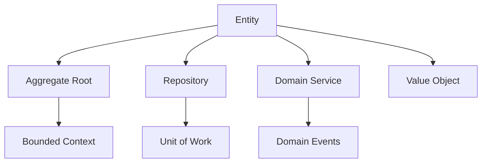

## 🏷️ Tags

#type/permanent #concept/ddd #ddd/entity #area/architecture #area/development 

---

# DDD.Entity

> [!abstract] 📋 Краткое описание Entity — это объект предметной области, который имеет уникальную идентичность и жизненный цикл. В отличие от Value Object, Entity важна не только своими атрибутами, но и своей идентичностью.

---

## 🎯 Чек-лист: что будет раскрыто

- [x] **Определение и ключевые характеристики** Entity
- [x] **Отличия от Value Object** и других DDD-объектов
- [x] **Правила проектирования** и лучшие практики
- [x] **Примеры реализации** на C# с комментариями
- [x] **Паттерны использования** в реальных системах
- [x] **Связи с другими** DDD-концепциями

---

## 📖 Содержание

1. [[#🔍 Определение Entity]]
2. [[#⚖️ Entity vs Value Object]]
3. [[#🏗️ Принципы проектирования]]
4. [[#💻 Примеры реализации]]
5. [[#🔗 Связи с другими концепциями]]
6. [[#✅ Лучшие практики]]

---

## 🔍 Определение Entity

> [!tip] ✨ Ключевая идея **Entity = Идентичность + Изменяемость + Жизненный цикл**

### Основные характеристики

|Характеристика|Описание|Пример|
|---|---|---|
|**🆔 Идентичность**|Уникальный идентификатор|UserId, OrderId|
|**🔄 Изменяемость**|Атрибуты могут меняться|Имя пользователя, статус заказа|
|**⏳ Жизненный цикл**|Создание → изменения → удаление|Регистрация → активность → деактивация|
|**🎭 Равенство по ID**|Два объекта равны, если ID равны|User(1) == User(1)|

---

## ⚖️ Entity vs Value Object

> [!note] 🔍 Ключевое различие **Entity**: "Кто это?" (идентичность важнее атрибутов)  
> **Value Object**: "Что это?" (важны только атрибуты)

| Критерий         | Entity               | [[DDD.ValueObject\|Value Object]] |
| ---------------- | -------------------- | ---------------------------------- |
| **Идентичность** | ✅ Есть уникальный ID | ❌ Нет ID                           |
| **Изменяемость** | ✅ Может изменяться   | ❌ Неизменяемый                     |
| **Равенство**    | По ID                | По всем атрибутам                  |
| **Пример**       | `User`, `Order`      | `Money`, `Address`                 |

---

## 🏗️ Принципы проектирования

### 🎯 Правило единственной ответственности

> [!warning] ⚠️ Важно Entity должна инкапсулировать **только ту логику, которая связана с её идентичностью и жизненным циклом**.

### 📝 Основные принципы

1. **Идентичность неизменна** — ID устанавливается при создании
2. **Инкапсуляция состояния** — изменения только через методы
3. **Валидация инвариантов** — проверка корректности при каждом изменении
4. **Доменная логика внутри** — бизнес-правила принадлежат Entity

---

## 💻 Примеры реализации

### 📄 Базовая реализация Entity

```csharp
public abstract class Entity<TId> : IEquatable<Entity<TId>>
    where TId : struct
{
    public TId Id { get; protected set; }
    
    protected Entity() { }
    
    protected Entity(TId id)
    {
        if (id.Equals(default(TId)))
            throw new ArgumentException("ID не может быть пустым", nameof(id));
            
        Id = id;
    }
    
    public bool Equals(Entity<TId> other)
    {
        if (other is null) return false;
        if (ReferenceEquals(this, other)) return true;
        return Id.Equals(other.Id);
    }
    
    public override bool Equals(object obj) => Equals(obj as Entity<TId>);
    public override int GetHashCode() => Id.GetHashCode();
    
    public static bool operator ==(Entity<TId> left, Entity<TId> right) => 
        left?.Equals(right) ?? right is null;
    public static bool operator !=(Entity<TId> left, Entity<TId> right) => 
        !(left == right);
}
```

### 👤 Конкретная Entity - User

```csharp
public class User : Entity<UserId>
{
    public string Email { get; private set; }
    public string FullName { get; private set; }
    public UserStatus Status { get; private set; }
    public DateTime CreatedAt { get; private set; }
    
    // Конструктор для создания
    public User(UserId id, string email, string fullName) : base(id)
    {
        SetEmail(email);
        SetFullName(fullName);
        Status = UserStatus.Active;
        CreatedAt = DateTime.UtcNow;
    }
    
    // Доменные методы с валидацией
    public void ChangeEmail(string newEmail)
    {
        SetEmail(newEmail);
        // Здесь может быть доменная логика: отправка уведомления и т.п.
    }
    
    public void Deactivate()
    {
        if (Status == UserStatus.Inactive)
            throw new InvalidOperationException("Пользователь уже деактивирован");
            
        Status = UserStatus.Inactive;
    }
    
    // Приватные методы валидации
    private void SetEmail(string email)
    {
        if (string.IsNullOrWhiteSpace(email))
            throw new ArgumentException("Email обязателен");
        if (!IsValidEmail(email))
            throw new ArgumentException("Некорректный формат email");
            
        Email = email;
    }
    
    private void SetFullName(string fullName)
    {
        if (string.IsNullOrWhiteSpace(fullName))
            throw new ArgumentException("Полное имя обязательно");
            
        FullName = fullName;
    }
    
    private bool IsValidEmail(string email) => 
        email.Contains("@") && email.Contains(".");
}

public enum UserStatus { Active, Inactive }

// Strongly-typed ID
public readonly struct UserId : IEquatable<UserId>
{
    public Guid Value { get; }
    
    public UserId(Guid value) => Value = value;
    public static implicit operator Guid(UserId id) => id.Value;
    public static implicit operator UserId(Guid value) => new(value);
    
    public bool Equals(UserId other) => Value.Equals(other.Value);
    public override bool Equals(object obj) => obj is UserId other && Equals(other);
    public override int GetHashCode() => Value.GetHashCode();
    
    public static bool operator ==(UserId left, UserId right) => left.Equals(right);
    public static bool operator !=(UserId left, UserId right) => !(left == right);
}
```

### 🛒 Entity с коллекциями - Order

```csharp
public class Order : Entity<OrderId>
{
    private readonly List<OrderItem> _items = new();
    
    public CustomerId CustomerId { get; private set; }
    public DateTime CreatedAt { get; private set; }
    public OrderStatus Status { get; private set; }
    public IReadOnlyList<OrderItem> Items => _items.AsReadOnly();
    
    public Money TotalAmount => _items.Sum(item => item.TotalPrice);
    
    public Order(OrderId id, CustomerId customerId) : base(id)
    {
        CustomerId = customerId;
        CreatedAt = DateTime.UtcNow;
        Status = OrderStatus.Draft;
    }
    
    public void AddItem(ProductId productId, int quantity, Money unitPrice)
    {
        EnsureOrderCanBeModified();
        
        var existingItem = _items.FirstOrDefault(i => i.ProductId == productId);
        if (existingItem != null)
        {
            existingItem.ChangeQuantity(existingItem.Quantity + quantity);
        }
        else
        {
            _items.Add(new OrderItem(productId, quantity, unitPrice));
        }
    }
    
    public void RemoveItem(ProductId productId)
    {
        EnsureOrderCanBeModified();
        _items.RemoveAll(i => i.ProductId == productId);
    }
    
    public void Confirm()
    {
        if (Status != OrderStatus.Draft)
            throw new InvalidOperationException("Только черновик заказа может быть подтверждён");
        if (!_items.Any())
            throw new InvalidOperationException("Заказ должен содержать хотя бы один товар");
            
        Status = OrderStatus.Confirmed;
    }
    
    private void EnsureOrderCanBeModified()
    {
        if (Status != OrderStatus.Draft)
            throw new InvalidOperationException("Изменение возможно только для черновиков");
    }
}

public enum OrderStatus { Draft, Confirmed, Shipped, Delivered }
```

---

## 🔗 Связи с другими концепциями

### 🏗️ Архитектурные связи



| Концепция                              | Связь с Entity                      | Пример                                      |
| -------------------------------------- | ----------------------------------- | ------------------------------------------- |
| **[[DDD.Aggregate\|Aggregate]]**       | Entity может быть корнем агрегата   | `Order` — корень, `OrderItem` — часть       |
| **[[DDD.Repository]]**                     | Репозиторий работает с Entity по ID | `UserRepository.GetById(userId)`            |
| **[[DDD.Domain Service]]**                 | Сервис координирует работу Entity   | `OrderService.Transfer(order, newCustomer)` |
| **[[DDD.ValueObject\|Value Object]]** | Entity содержит Value Objects       | `User.Address`, `Order.TotalAmount`         |
|                                        |                                     |                                             |

---

## ✅ Лучшие практики

### 🎯 Do's (Делайте)

> [!success] ✅ Рекомендации
> 
> - **Используйте strongly-typed ID** (`UserId` вместо `Guid`)
> - **Инкапсулируйте состояние** — приватные setters, публичные методы
> - **Валидируйте инварианты** при каждом изменении
> - **Делайте Entity богатыми** — добавляйте доменную логику
> - **Используйте фабричные методы** для создания

### 🚫 Don'ts (Не делайте)

> [!danger] ❌ Чего избегать
> 
> - **Анемичные Entity** — только getters/setters без логики
> - **Публичные setters** — нарушают инкапсуляцию
> - **Большие Entity** — разбивайте на агрегаты
> - **ID в конструкторе по умолчанию** — ID должен быть обязательным
> - **Сравнение по атрибутам** — только по ID

### 🔧 Паттерны использования

|Паттерн|Применение|Код|
|---|---|---|
|**Factory Method**|Создание Entity|`User.CreateActive(email, name)`|
|**Specification**|Сложная логика проверки|`user.Satisfies(new ActiveUserSpec())`|
|**Domain Events**|Уведомления об изменениях|`user.RaiseDomainEvent(new UserDeactivated())`|

---

## 🔍 См. также

- [[DDD]] — основные концепции Domain-Driven Design
- [[DDD.ValueObject|DDD - Value Object]] — объекты без идентичности
- [[DDD.Aggregate|DDD - Aggregate]] — группировка связанных Entity
- [[ddd/domain-service|Domain Service]] — координация между Entity
- [[concept/repository|Repository Pattern]] — доступ к Entity
- [[design-pattern/factory|Factory Pattern]] — создание Entity

---

> [!quote] 💡 Ключевая мысль "Entity — это объект, который мы отслеживаем во времени, несмотря на то, что его атрибуты могут изменяться. Его идентичность остается постоянной на протяжении всего жизненного цикла." — Eric Evans, Domain-Driven Design