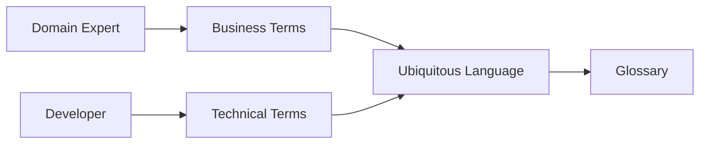
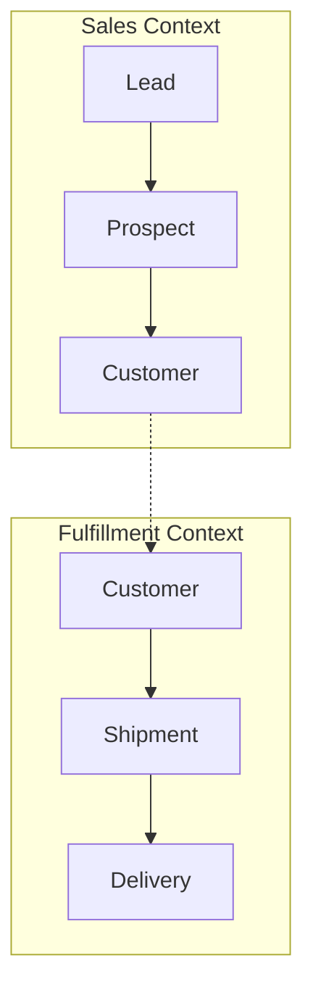

---
aliases:
  - DDD.Ubiquitous Language
  - Ubiquitous Language
tags:
  - type/permanent
  - status/active
  - concept/ddd
  - ddd/ubiquitous-language
  - area/architecture
title: DDD.Ubiquitous Language
linter-yaml-title-alias: DDD.Ubiquitous Language
date created: Monday, September 8th 2025, 2:54:56 pm
date modified: Tuesday, September 9th 2025, 5:10:19 am
---

## 🏷️ Tags

#type/permanent #status/active #concept/ddd #ddd/ubiquitous-language #area/architecture 

---

# DDD.Ubiquitous Language

> [!abstract] 📋 Чек-лист изучения
> 
> - [ ] Понять определение и цель Ubiquitous Language
> - [ ] Изучить процесс формирования единого языка
> - [ ] Освоить практики применения в коде и документации
> - [ ] Понять связь с Bounded Context
> - [ ] Изучить инструменты для поддержания языка
> - [ ] Рассмотреть типичные проблемы и их решения

---

## 📖 Оглавление

1. [Определение и цель](https://claude.ai/chat/01c45662-5d35-48e4-8094-4161bd2f6a06#%D0%BE%D0%BF%D1%80%D0%B5%D0%B4%D0%B5%D0%BB%D0%B5%D0%BD%D0%B8%D0%B5-%D0%B8-%D1%86%D0%B5%D0%BB%D1%8C)
2. [Процесс формирования](https://claude.ai/chat/01c45662-5d35-48e4-8094-4161bd2f6a06#%D0%BF%D1%80%D0%BE%D1%86%D0%B5%D1%81%D1%81-%D1%84%D0%BE%D1%80%D0%BC%D0%B8%D1%80%D0%BE%D0%B2%D0%B0%D0%BD%D0%B8%D1%8F)
3. [Применение в коде](https://claude.ai/chat/01c45662-5d35-48e4-8094-4161bd2f6a06#%D0%BF%D1%80%D0%B8%D0%BC%D0%B5%D0%BD%D0%B5%D0%BD%D0%B8%D0%B5-%D0%B2-%D0%BA%D0%BE%D0%B4%D0%B5)
4. [Связь с Bounded Context](https://claude.ai/chat/01c45662-5d35-48e4-8094-4161bd2f6a06#%D1%81%D0%B2%D1%8F%D0%B7%D1%8C-%D1%81-bounded-context)
5. [Инструменты поддержания](https://claude.ai/chat/01c45662-5d35-48e4-8094-4161bd2f6a06#%D0%B8%D0%BD%D1%81%D1%82%D1%80%D1%83%D0%BC%D0%B5%D0%BD%D1%82%D1%8B-%D0%BF%D0%BE%D0%B4%D0%B4%D0%B5%D1%80%D0%B6%D0%B0%D0%BD%D0%B8%D1%8F)
6. [Типичные проблемы](https://claude.ai/chat/01c45662-5d35-48e4-8094-4161bd2f6a06#%D1%82%D0%B8%D0%BF%D0%B8%D1%87%D0%BD%D1%8B%D0%B5-%D0%BF%D1%80%D0%BE%D0%B1%D0%BB%D0%B5%D0%BC%D1%8B)

---

## 🎯 Определение и цель

> [!info] 💡 Определение **Ubiquitous Language** — это общий язык, используемый всеми участниками проекта (разработчиками, аналитиками, экспертами предметной области) для описания бизнес-процессов и концепций домена.

### Основные принципы

|Принцип|Описание|Пример|
|---|---|---|
|**Единство**|Один термин — одно понятие|`Order` только для заказа, не для сортировки|
|**Точность**|Термины отражают бизнес-реальность|`Customer` вместо `User` в e-commerce|
|**Эволюция**|Язык развивается вместе с пониманием|Уточнение терминов по мере изучения домена|
|**Повсеместность**|Используется везде: в коде, документах, диалогах|Консистентность на всех уровнях|

---

## 🔄 Процесс формирования

> [!tip] 🏗️ Этапы создания Ubiquitous Language

### 1. Извлечение терминов



### 2. Collaborative modeling

|Активность|Участники|Результат|
|---|---|---|
|**Event Storming**|Все заинтересованные стороны|Общее понимание процессов|
|**Domain Storytelling**|Domain Expert + Dev Team|Нарративы бизнес-сценариев|
|**Glossary Building**|Вся команда|Словарь терминов|

### 3. Итеративное уточнение

> [!warning] ⚠️ Важно Ubiquitous Language — это не статичный артефакт. Он постоянно эволюционирует по мере углубления понимания домена.

---

## 💻 Применение в коде

### Именование классов и методов

```csharp
// ❌ Плохо - технические термины
public class OrderManager
{
    public void ProcessOrder(OrderData data) { }
}

// ✅ Хорошо - бизнес-термины
public class OrderProcessingService
{
    public void FulfillOrder(Order order) { }
    public void CancelOrder(OrderId orderId) { }
}
```

### Value Objects отражают язык

```csharp
// Термины из Ubiquitous Language становятся типами
public record CustomerId(Guid Value);
public record ProductCode(string Value);
public record MonetaryAmount(decimal Amount, Currency Currency);

// Бизнес-правила выражены через язык домена
public class Order
{
    public void ApplyDiscount(DiscountPolicy policy)
    {
        // Бизнес-логика использует термины домена
    }
}
```

### Методы как бизнес-операции

> [!example] 🔧 Пример: E-commerce домен
> 
> ```csharp
> public class ShoppingCart
> {
>     // Операции названы так, как говорят пользователи
>     public void AddItem(ProductId productId, Quantity quantity);
>     public void RemoveItem(ProductId productId);
>     public void ApplyPromoCode(PromoCode code);
>     public Order Checkout(ShippingAddress address, PaymentMethod payment);
> }
> ```

---

## 🏢 Связь с Bounded Context

> [!note] 🔗 Контекстуальность языка Один и тот же термин может иметь разные значения в разных [[MOC - DDD - Bounded Context|Bounded Context]]'ах.

### Пример: Термин "Customer"

|Bounded Context|Значение термина "Customer"|Атрибуты|
|---|---|---|
|**Sales**|Потенциальный покупатель|Name, Email, LeadScore|
|**Billing**|Плательщик|AccountNumber, CreditLimit, PaymentTerms|
|**Support**|Пользователь с проблемами|TicketHistory, SupportLevel, ContactPreference|

### Context Map для языка



---

## 🛠️ Инструменты поддержания

### 1. Живая документация

> [!success] ✨ Лучшие практики
> 
> - **Domain Glossary** — централизованный словарь терминов
> - **Context Canvas** — визуальное представление контекста
> - **Decision Records** — фиксация решений об изменениях языка

### 2. Автоматизация

```csharp
// Тесты как документация языка
[Test]
public void Customer_CanPlaceOrder_WhenAccountIsActive()
{
    // Arrange
    var customer = CustomerBuilder.Active().Build();
    var product = ProductBuilder.InStock().Build();
    
    // Act
    var order = customer.PlaceOrder(product);
    
    // Assert
    order.Status.Should().Be(OrderStatus.Pending);
}
```

### 3. Инструменты команды

|Инструмент|Назначение|Пример использования|
|---|---|---|
|**Confluence/Notion**|Централизованный глоссарий|Определения терминов с примерами|
|**Miro/Mural**|Визуальное моделирование|Event Storming, Domain Storytelling|
|**Code Reviews**|Контроль языка в коде|Проверка соответствия naming conventions|

---

## ⚠️ Типичные проблемы

### 1. Проблема перевода

> [!danger] 🚫 Антипаттерн: Translation Layer
> 
> ```csharp
> // Плохо - слой перевода между бизнес и техническими терминами
> public class OrderTranslator
> {
>     public OrderDto ToDto(BusinessOrder order) { }
>     public BusinessOrder FromDto(OrderDto dto) { }
> }
> ```

### 2. Технический жаргон в бизнес-логике

```csharp
// ❌ Плохо
public void ExecuteBatch() { }
public void ProcessQueue() { }

// ✅ Хорошо  
public void ProcessDailyOrders() { }
public void HandleCustomerRequests() { }
```

### 3. Множественные термины для одного понятия

> [!warning] ⚠️ Проблема синонимов Избегайте ситуации, когда `User`, `Customer`, `Client` означают одно и то же в рамках одного контекста.

### Решение проблем

| Проблема                         | Решение                                     | Инструмент                       |
| -------------------------------- | ------------------------------------------- | -------------------------------- |
| **Неточные термины**             | Регулярные сессии уточнения с domain expert | Domain Storytelling              |
| **Расхождение код/документация** | Живая документация, генерация из кода       | ArchUnit, PlantUML               |
| **Потеря контекста**             | Явное определение границ контекста          | [[DDD.Context Map\|Context Map]] |

---

## 🔗 Связанные концепции

- [[MOC - DDD - Bounded Context|Bounded Context]] - Границы применения языка
- [[DDD.EventStorming|Event Storming]] - Инструмент формирования языка
- [[DDD.Context Map|Context Map]] - Отношения между контекстами и языками
- [[DDD.Domain Service|Domain Service]] - Реализация бизнес-операций через язык домена

---

> [!quote] 💭 Ключевая мысль "The language you use becomes the language you think in. Make sure it's the right one." — Eric Evans
