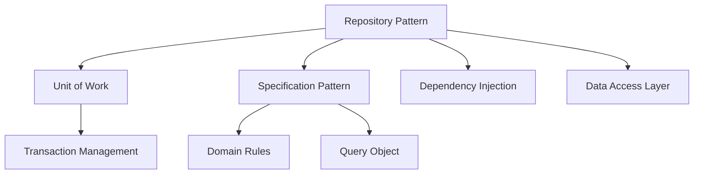

---
aliases:
  - GoF.Repository.Specification
  - Specification
tags:
  - type/permanent
  - status/active
  - area/development
  - area/architecture
  - tech/csharp
  - tech/asp-net
  - concept/ddd
  - concept/clean-architecture
  - design-pattern/reposiroty
  - design-pattern/specification
  - design-pattern/dependency-injection
  - design-pattern/uow
title: GoF.Repository.Specification
linter-yaml-title-alias: GoF.Repository.Specification
date created: Tuesday, September 9th 2025, 5:38:45 am
date modified: Tuesday, September 9th 2025, 5:43:19 am
---

## 🏷️ Tags

#type/permanent #status/active #area/development #area/architecture #tech/csharp #tech/asp-net #concept/ddd #concept/clean-architecture #design-pattern/reposiroty #design-pattern/specification #design-pattern/dependency-injection #design-pattern/uow 

---

# GoF.Repository.Specification

> [!abstract] 🎯 О чем эта заметка Подробное руководство по реализации паттернов Repository и Specification в .NET приложениях с примерами кода и лучшими практиками.

---

## 📋 Что будет раскрыто

- [ ] **Repository Pattern** - абстракция над слоем доступа к данным
- [ ] **Specification Pattern** - инкапсуляция бизнес-правил для запросов
- [ ] **Интеграция паттернов** - совместное использование
- [ ] **Реализация в .NET** - практические примеры с EF Core
- [ ] **Unit of Work** - управление транзакциями
- [ ] **Тестирование** - моки и юнит-тесты
- [ ] **Анти-паттерны** - чего избегать

---

## 📑 Содержание

1. [[#🏛️ Repository Pattern]]
2. [[#📐 Specification Pattern]]
3. [[#🔗 Интеграция паттернов]]
4. [[#💻 Реализация в .NET]]
5. [[#🔄 Unit of Work]]
6. [[#🧪 Тестирование]]
7. [[#⚠️ Анти-паттерны]]
8. [[#📚 Связанные концепции]]

---

## 🏛️ Repository Pattern

> [!info] 💡 Определение **Repository Pattern** — паттерн, который инкапсулирует логику доступа к данным и обеспечивает единообразный интерфейс для работы с коллекциями объектов.

### Преимущества

|Преимущество|Описание|
|---|---|
|**Тестируемость**|Легко мокать для unit-тестов|
|**Абстракция**|Скрывает детали ORM/базы данных|
|**Переиспользование**|Общие методы для всех сущностей|
|**Централизация**|Вся логика запросов в одном месте|

### Базовая структура

```csharp
// Базовый интерфейс репозитория
public interface IRepository<T> where T : class
{
    Task<T?> GetByIdAsync(int id);
    Task<IEnumerable<T>> GetAllAsync();
    Task<T> AddAsync(T entity);
    Task UpdateAsync(T entity);
    Task DeleteAsync(int id);
    Task<bool> ExistsAsync(int id);
}

// Специфичный репозиторий
public interface IUserRepository : IRepository<User>
{
    Task<User?> GetByEmailAsync(string email);
    Task<IEnumerable<User>> GetActiveUsersAsync();
    Task<IEnumerable<User>> GetUsersByRoleAsync(string role);
}
```

---

## 📐 Specification Pattern

> [!info] 💡 Определение **Specification Pattern** — паттерн, который инкапсулирует бизнес-правила в переиспользуемые объекты-спецификации для создания сложных запросов.

### Базовая структура спецификации

```csharp
// Базовый интерфейс спецификации
public interface ISpecification<T>
{
    Expression<Func<T, bool>> ToExpression();
    bool IsSatisfiedBy(T entity);
}

// Абстрактный базовый класс
public abstract class Specification<T> : ISpecification<T>
{
    public abstract Expression<Func<T, bool>> ToExpression();
    
    public bool IsSatisfiedBy(T entity)
    {
        var predicate = ToExpression().Compile();
        return predicate(entity);
    }

    // Операторы для комбинирования спецификаций
    public Specification<T> And(Specification<T> specification)
        => new AndSpecification<T>(this, specification);
    
    public Specification<T> Or(Specification<T> specification)
        => new OrSpecification<T>(this, specification);
    
    public Specification<T> Not()
        => new NotSpecification<T>(this);
}
```

### Композитные спецификации

```csharp
// И-спецификация
public class AndSpecification<T> : Specification<T>
{
    private readonly Specification<T> _left;
    private readonly Specification<T> _right;

    public AndSpecification(Specification<T> left, Specification<T> right)
    {
        _left = left;
        _right = right;
    }

    public override Expression<Func<T, bool>> ToExpression()
    {
        var leftExpression = _left.ToExpression();
        var rightExpression = _right.ToExpression();
        
        var parameter = leftExpression.Parameters[0];
        var combined = Expression.AndAlso(
            leftExpression.Body,
            Expression.Invoke(rightExpression, parameter)
        );
        
        return Expression.Lambda<Func<T, bool>>(combined, parameter);
    }
}

// ИЛИ-спецификация
public class OrSpecification<T> : Specification<T>
{
    private readonly Specification<T> _left;
    private readonly Specification<T> _right;

    public OrSpecification(Specification<T> left, Specification<T> right)
    {
        _left = left;
        _right = right;
    }

    public override Expression<Func<T, bool>> ToExpression()
    {
        var leftExpression = _left.ToExpression();
        var rightExpression = _right.ToExpression();
        
        var parameter = leftExpression.Parameters[0];
        var combined = Expression.OrElse(
            leftExpression.Body,
            Expression.Invoke(rightExpression, parameter)
        );
        
        return Expression.Lambda<Func<T, bool>>(combined, parameter);
    }
}
```

---

## 🔗 Интеграция паттернов

### Расширенный интерфейс репозитория

```csharp
public interface IRepository<T> where T : class
{
    // Базовые методы
    Task<T?> GetByIdAsync(int id);
    Task<IEnumerable<T>> GetAllAsync();
    
    // Методы со спецификациями
    Task<T?> GetFirstAsync(ISpecification<T> specification);
    Task<IEnumerable<T>> FindAsync(ISpecification<T> specification);
    Task<int> CountAsync(ISpecification<T> specification);
    Task<bool> AnyAsync(ISpecification<T> specification);
    
    // CRUD операции
    Task<T> AddAsync(T entity);
    Task UpdateAsync(T entity);
    Task DeleteAsync(int id);
}
```

### Примеры бизнес-спецификаций

```csharp
// Спецификация активных пользователей
public class ActiveUserSpecification : Specification<User>
{
    public override Expression<Func<User, bool>> ToExpression()
        => user => user.IsActive && !user.IsDeleted;
}

// Спецификация пользователей по роли
public class UserByRoleSpecification : Specification<User>
{
    private readonly string _role;

    public UserByRoleSpecification(string role)
    {
        _role = role;
    }

    public override Expression<Func<User, bool>> ToExpression()
        => user => user.Role == _role;
}

// Спецификация пользователей по возрасту
public class UserByAgeRangeSpecification : Specification<User>
{
    private readonly int _minAge;
    private readonly int _maxAge;

    public UserByAgeRangeSpecification(int minAge, int maxAge)
    {
        _minAge = minAge;
        _maxAge = maxAge;
    }

    public override Expression<Func<User, bool>> ToExpression()
        => user => user.Age >= _minAge && user.Age <= _maxAge;
}
```

---

## 💻 Реализация в .NET

### Реализация с Entity Framework Core

```csharp
public class EfRepository<T> : IRepository<T> where T : class
{
    protected readonly DbContext _context;
    protected readonly DbSet<T> _dbSet;

    public EfRepository(DbContext context)
    {
        _context = context;
        _dbSet = context.Set<T>();
    }

    public async Task<T?> GetByIdAsync(int id)
    {
        return await _dbSet.FindAsync(id);
    }

    public async Task<IEnumerable<T>> GetAllAsync()
    {
        return await _dbSet.ToListAsync();
    }

    public async Task<T?> GetFirstAsync(ISpecification<T> specification)
    {
        return await _dbSet
            .Where(specification.ToExpression())
            .FirstOrDefaultAsync();
    }

    public async Task<IEnumerable<T>> FindAsync(ISpecification<T> specification)
    {
        return await _dbSet
            .Where(specification.ToExpression())
            .ToListAsync();
    }

    public async Task<int> CountAsync(ISpecification<T> specification)
    {
        return await _dbSet
            .Where(specification.ToExpression())
            .CountAsync();
    }

    public async Task<bool> AnyAsync(ISpecification<T> specification)
    {
        return await _dbSet
            .Where(specification.ToExpression())
            .AnyAsync();
    }

    public async Task<T> AddAsync(T entity)
    {
        var entry = await _dbSet.AddAsync(entity);
        return entry.Entity;
    }

    public async Task UpdateAsync(T entity)
    {
        _dbSet.Update(entity);
        await Task.CompletedTask;
    }

    public async Task DeleteAsync(int id)
    {
        var entity = await GetByIdAsync(id);
        if (entity != null)
        {
            _dbSet.Remove(entity);
        }
    }
}
```

### Специфичный репозиторий пользователей

```csharp
public class UserRepository : EfRepository<User>, IUserRepository
{
    public UserRepository(AppDbContext context) : base(context) { }

    public async Task<User?> GetByEmailAsync(string email)
    {
        return await _dbSet
            .FirstOrDefaultAsync(u => u.Email == email);
    }

    public async Task<IEnumerable<User>> GetActiveUsersAsync()
    {
        var specification = new ActiveUserSpecification();
        return await FindAsync(specification);
    }

    public async Task<IEnumerable<User>> GetUsersByRoleAsync(string role)
    {
        var specification = new UserByRoleSpecification(role);
        return await FindAsync(specification);
    }

    // Комбинирование спецификаций
    public async Task<IEnumerable<User>> GetActiveUsersByRoleAsync(string role)
    {
        var activeSpec = new ActiveUserSpecification();
        var roleSpec = new UserByRoleSpecification(role);
        var combinedSpec = activeSpec.And(roleSpec);
        
        return await FindAsync(combinedSpec);
    }
}
```

---

## 🔄 Unit of Work

> [!tip] 💡 Зачем Unit of Work? Паттерн **Unit of Work** обеспечивает атомарность операций и управляет жизненным циклом DbContext.

```csharp
public interface IUnitOfWork : IDisposable
{
    IUserRepository Users { get; }
    IOrderRepository Orders { get; }
    IProductRepository Products { get; }
    
    Task<int> SaveChangesAsync();
    Task BeginTransactionAsync();
    Task CommitTransactionAsync();
    Task RollbackTransactionAsync();
}

public class EfUnitOfWork : IUnitOfWork
{
    private readonly AppDbContext _context;
    private IDbContextTransaction? _transaction;

    public EfUnitOfWork(AppDbContext context)
    {
        _context = context;
        Users = new UserRepository(_context);
        Orders = new OrderRepository(_context);
        Products = new ProductRepository(_context);
    }

    public IUserRepository Users { get; }
    public IOrderRepository Orders { get; }
    public IProductRepository Products { get; }

    public async Task<int> SaveChangesAsync()
    {
        return await _context.SaveChangesAsync();
    }

    public async Task BeginTransactionAsync()
    {
        _transaction = await _context.Database.BeginTransactionAsync();
    }

    public async Task CommitTransactionAsync()
    {
        if (_transaction != null)
        {
            await _transaction.CommitAsync();
            await _transaction.DisposeAsync();
            _transaction = null;
        }
    }

    public async Task RollbackTransactionAsync()
    {
        if (_transaction != null)
        {
            await _transaction.RollbackAsync();
            await _transaction.DisposeAsync();
            _transaction = null;
        }
    }

    public void Dispose()
    {
        _transaction?.Dispose();
        _context.Dispose();
    }
}
```

### Использование в сервисе

```csharp
public class UserService
{
    private readonly IUnitOfWork _unitOfWork;

    public UserService(IUnitOfWork unitOfWork)
    {
        _unitOfWork = unitOfWork;
    }

    public async Task<IEnumerable<User>> GetActiveAdminUsersAsync()
    {
        var activeSpec = new ActiveUserSpecification();
        var adminSpec = new UserByRoleSpecification("Admin");
        var combinedSpec = activeSpec.And(adminSpec);
        
        return await _unitOfWork.Users.FindAsync(combinedSpec);
    }

    public async Task CreateUserWithOrderAsync(User user, Order order)
    {
        try
        {
            await _unitOfWork.BeginTransactionAsync();
            
            await _unitOfWork.Users.AddAsync(user);
            await _unitOfWork.SaveChangesAsync();
            
            order.UserId = user.Id;
            await _unitOfWork.Orders.AddAsync(order);
            await _unitOfWork.SaveChangesAsync();
            
            await _unitOfWork.CommitTransactionAsync();
        }
        catch
        {
            await _unitOfWork.RollbackTransactionAsync();
            throw;
        }
    }
}
```

---

## 🧪 Тестирование

### Мокирование репозитория

```csharp
[Test]
public async Task GetActiveUsers_ShouldReturnOnlyActiveUsers()
{
    // Arrange
    var users = new List<User>
    {
        new() { Id = 1, Name = "Active User", IsActive = true, IsDeleted = false },
        new() { Id = 2, Name = "Inactive User", IsActive = false, IsDeleted = false },
        new() { Id = 3, Name = "Deleted User", IsActive = true, IsDeleted = true }
    };

    var mockRepository = new Mock<IUserRepository>();
    var specification = new ActiveUserSpecification();
    
    mockRepository
        .Setup(r => r.FindAsync(It.IsAny<ISpecification<User>>()))
        .ReturnsAsync(users.Where(u => specification.IsSatisfiedBy(u)));

    var userService = new UserService(mockRepository.Object);

    // Act
    var result = await userService.GetActiveUsersAsync();

    // Assert
    result.Should().HaveCount(1);
    result.First().Name.Should().Be("Active User");
}
```

### Тестирование спецификаций

```csharp
[Test]
public void ActiveUserSpecification_ShouldReturnTrueForActiveUser()
{
    // Arrange
    var specification = new ActiveUserSpecification();
    var activeUser = new User { IsActive = true, IsDeleted = false };
    var inactiveUser = new User { IsActive = false, IsDeleted = false };

    // Act & Assert
    specification.IsSatisfiedBy(activeUser).Should().BeTrue();
    specification.IsSatisfiedBy(inactiveUser).Should().BeFalse();
}

[Test]
public void CombinedSpecification_ShouldWorkCorrectly()
{
    // Arrange
    var activeSpec = new ActiveUserSpecification();
    var adminSpec = new UserByRoleSpecification("Admin");
    var combinedSpec = activeSpec.And(adminSpec);

    var activeAdmin = new User 
    { 
        IsActive = true, 
        IsDeleted = false, 
        Role = "Admin" 
    };

    var inactiveAdmin = new User 
    { 
        IsActive = false, 
        IsDeleted = false, 
        Role = "Admin" 
    };

    // Act & Assert
    combinedSpec.IsSatisfiedBy(activeAdmin).Should().BeTrue();
    combinedSpec.IsSatisfiedBy(inactiveAdmin).Should().BeFalse();
}
```

---

## ⚠️ Анти-паттерны

> [!warning] 🚨 Чего избегать

### ❌ Repository как обертка над ORM

```csharp
// ПЛОХО: Простая обертка без добавленной стоимости
public class UserRepository : IUserRepository
{
    public async Task<User> GetByIdAsync(int id)
        => await _context.Users.FindAsync(id); // Прямое использование EF

    public async Task<IEnumerable<User>> GetAllAsync()
        => await _context.Users.ToListAsync(); // Нет бизнес-логики
}
```

### ❌ Слишком конкретные методы

```csharp
// ПЛОХО: Много специфичных методов
public interface IUserRepository
{
    Task<IEnumerable<User>> GetActiveUsersAsync();
    Task<IEnumerable<User>> GetInactiveUsersAsync();
    Task<IEnumerable<User>> GetDeletedUsersAsync();
    Task<IEnumerable<User>> GetAdminUsersAsync();
    Task<IEnumerable<User>> GetActiveAdminUsersAsync();
    Task<IEnumerable<User>> GetInactiveAdminUsersAsync();
    // ... еще 20 методов
}
```

### ❌ Нарушение инкапсуляции

```csharp
// ПЛОХО: Возврат IQueryable нарушает абстракцию
public interface IUserRepository
{
    IQueryable<User> GetUsers(); // Клиент получает доступ к ORM
}
```

### ✅ Правильный подход

```csharp
// ХОРОШО: Гибкий интерфейс со спецификациями
public interface IUserRepository
{
    Task<IEnumerable<User>> FindAsync(ISpecification<User> specification);
    Task<User?> GetFirstAsync(ISpecification<User> specification);
    Task<int> CountAsync(ISpecification<User> specification);
    Task<bool> AnyAsync(ISpecification<User> specification);
}
```

---

## 📚 Связанные концепции

### Связи с другими паттернами



| Концепция                                       | Связь                                         | Заметка                         |
| ----------------------------------------------- | --------------------------------------------- | ------------------------------- |
| [[DDD]]                                         | Repository - часть инфраструктуры             | `#concept/ddd`                  |
| [[Dependency Injection]]                        | Внедрение репозиториев                        | `#concept/dependency-injection` |
| [[Unit of Work]]                                | Управление транзакциями                       | `#design-pattern/uow`           |
| [[MOC - Clean Architcture\|Clean Architecture]] | Репозиторий в слое инфраструктуры             | `#concept/clean-architecture`   |
| [[MOC - ArchPat - CQRS\|CQRS]]                  | Разделение репозиториев для команд и запросов | `#concept/cqrs`                 |

---

## 🔗 Дополнительные ресурсы

> [!example] 📖 Полезные ссылки
> 
> - [Microsoft Docs: Repository Pattern](https://docs.microsoft.com/en-us/dotnet/architecture/microservices/microservice-ddd-cqrs-patterns/infrastructure-persistence-layer-design)
> - [Entity Framework Core Best Practices](https://docs.microsoft.com/en-us/ef/core/)
> - [Domain-Driven Design Reference](https://domainlanguage.com/ddd/reference/)

---

> [!success] ✨ Заключение Repository и Specification паттерны обеспечивают чистую архитектуру, тестируемость и гибкость в работе с данными. Правильная реализация позволяет легко менять источники данных и создавать сложные запросы через композицию спецификаций.