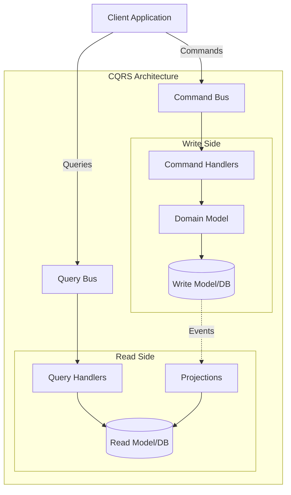

## 🏷️ Tags

#type/moc #concept/ddd #concept/clean-architecture #design-pattern/mediator #tech/csharp #tech/asp-net #area/architecture #area/development #status/active 

---

# MOC - Architecture Patterns - CQRS

> [!info] 📋 О паттерне **CQRS (Command Query Responsibility Segregation)** — архитектурный паттерн, разделяющий операции чтения и записи в отдельные модели, что позволяет оптимизировать каждую под конкретные задачи.

---

## 🎯 Что изучим

- [ ] **Основы CQRS** — принципы и мотивация
- [ ] **Command и Query** — разделение ответственности
- [ ] **Реализация в .NET** — MediatR, чистые интерфейсы
- [ ] **Паттерны проектирования** — Handler, Repository, Specification
- [ ] **Интеграция с DDD** — Aggregates, Domain Events
- [ ] **Практические примеры** — готовый к использованию код
- [ ] **Лучшие практики** — когда использовать, антипаттерны

---

## 📑 Содержание

1. [[#🎯 Основы CQRS]]
2. [[#⚡ Commands (Команды)]]
3. [[#🔍 Queries (Запросы)]]
4. [[#🎭 Реализация через MediatR]]
5. [[#🏗️ Архитектурные слои]]
6. [[#🔗 Интеграция с DDD]]
7. [[#📝 Практические примеры]]
8. [[#✅ Лучшие практики]]
9. [[#❌ Антипаттерны]]

---

## 🎯 Основы CQRS

### 🤔 Проблема традиционного подхода

> [!warning] ⚠️ Проблемы единой модели
> 
> - **Конфликт требований**: чтение требует денормализацию, запись — нормализацию
> - **Сложность валидации**: разные правила для разных операций
> - **Производительность**: оптимизация под одну операцию ухудшает другую
> - **Масштабирование**: разная нагрузка на чтение/запись

### 💡 Решение CQRS



> [!tip] ✨ Преимущества CQRS
> 
> - **Разделение ответственности**: каждая модель оптимизирована под свои задачи
> - **Масштабируемость**: независимое масштабирование чтения/записи
> - **Простота**: каждый handler решает одну задачу
> - **Гибкость**: разные технологии для разных нужд

---

## ⚡ Commands (Команды)

### 📝 Структура Command

> [!example] 🔧 Базовый интерфейс

```csharp
// Команда без результата
public interface ICommand : IRequest
{
}

// Команда с результатом
public interface ICommand<out TResult> : IRequest<TResult>
{
}

// Пример команды создания пользователя
public record CreateUserCommand(
    string Email,
    string FirstName, 
    string LastName,
    string Password
) : ICommand<Guid>;

// Команда обновления без результата
public record UpdateUserCommand(
    Guid UserId,
    string FirstName,
    string LastName
) : ICommand;
```

### 🎯 Command Handler

```csharp
public class CreateUserCommandHandler 
    : IRequestHandler<CreateUserCommand, Guid>
{
    private readonly IUserRepository _repository;
    private readonly IPasswordHasher _passwordHasher;
    private readonly IValidator<CreateUserCommand> _validator;
    private readonly IMediator _mediator;

    public CreateUserCommandHandler(
        IUserRepository repository,
        IPasswordHasher passwordHasher, 
        IValidator<CreateUserCommand> validator,
        IMediator mediator)
    {
        _repository = repository;
        _passwordHasher = passwordHasher;
        _validator = validator;
        _mediator = mediator;
    }

    public async Task<Guid> Handle(
        CreateUserCommand request, 
        CancellationToken cancellationToken)
    {
        // 1. Валидация
        await _validator.ValidateAndThrowAsync(request, cancellationToken);
        
        // 2. Бизнес-логика
        var hashedPassword = _passwordHasher.HashPassword(request.Password);
        
        var user = User.Create(
            request.Email,
            request.FirstName, 
            request.LastName,
            hashedPassword);
            
        // 3. Сохранение
        await _repository.AddAsync(user, cancellationToken);
        await _repository.SaveChangesAsync(cancellationToken);
        
        // 4. Публикация событий
        await _mediator.Publish(
            new UserCreatedDomainEvent(user.Id, user.Email), 
            cancellationToken);
            
        return user.Id;
    }
}
```

### ✅ Валидация Commands

```csharp
public class CreateUserCommandValidator 
    : AbstractValidator<CreateUserCommand>
{
    public CreateUserCommandValidator(IUserRepository repository)
    {
        RuleFor(x => x.Email)
            .NotEmpty()
            .EmailAddress()
            .MustAsync(async (email, ct) => 
                !await repository.ExistsAsync(u => u.Email == email, ct))
            .WithMessage("Пользователь с таким email уже существует");
            
        RuleFor(x => x.FirstName)
            .NotEmpty()
            .MaximumLength(100);
            
        RuleFor(x => x.LastName)
            .NotEmpty() 
            .MaximumLength(100);
            
        RuleFor(x => x.Password)
            .NotEmpty()
            .MinimumLength(8)
            .Matches(@"^(?=.*[a-z])(?=.*[A-Z])(?=.*\d)")
            .WithMessage("Пароль должен содержать строчные, заглавные буквы и цифры");
    }
}
```

---

## 🔍 Queries (Запросы)

### 📊 Query структура

```csharp
// Базовый интерфейс запроса
public interface IQuery<out TResult> : IRequest<TResult>
{
}

// DTO для ответа
public record UserDto(
    Guid Id,
    string Email, 
    string FirstName,
    string LastName,
    DateTime CreatedAt,
    bool IsActive
);

// Запрос пользователя по ID
public record GetUserByIdQuery(Guid UserId) : IQuery<UserDto?>;

// Запрос списка пользователей с пагинацией
public record GetUsersQuery(
    int Page = 1,
    int PageSize = 20,
    string? SearchTerm = null,
    bool? IsActive = null
) : IQuery<PagedResult<UserDto>>;
```

### 🎯 Query Handler

```csharp
public class GetUserByIdQueryHandler 
    : IRequestHandler<GetUserByIdQuery, UserDto?>
{
    private readonly IReadOnlyRepository<User> _repository;

    public GetUserByIdQueryHandler(IReadOnlyRepository<User> repository)
    {
        _repository = repository;
    }

    public async Task<UserDto?> Handle(
        GetUserByIdQuery request, 
        CancellationToken cancellationToken)
    {
        var user = await _repository
            .FirstOrDefaultAsync(
                u => u.Id == request.UserId, 
                cancellationToken);

        return user?.ToDto();
    }
}

// Более сложный Query Handler с фильтрацией
public class GetUsersQueryHandler 
    : IRequestHandler<GetUsersQuery, PagedResult<UserDto>>
{
    private readonly IReadOnlyRepository<User> _repository;

    public GetUsersQueryHandler(IReadOnlyRepository<User> repository)
    {
        _repository = repository;
    }

    public async Task<PagedResult<UserDto>> Handle(
        GetUsersQuery request, 
        CancellationToken cancellationToken)
    {
        var query = _repository.AsQueryable();

        // Применение фильтров
        if (!string.IsNullOrWhiteSpace(request.SearchTerm))
        {
            query = query.Where(u => 
                u.FirstName.Contains(request.SearchTerm) ||
                u.LastName.Contains(request.SearchTerm) ||
                u.Email.Contains(request.SearchTerm));
        }

        if (request.IsActive.HasValue)
        {
            query = query.Where(u => u.IsActive == request.IsActive.Value);
        }

        // Подсчет общего количества
        var totalCount = await query.CountAsync(cancellationToken);

        // Пагинация и материализация
        var users = await query
            .OrderBy(u => u.LastName)
            .ThenBy(u => u.FirstName)
            .Skip((request.Page - 1) * request.PageSize)
            .Take(request.PageSize)
            .Select(u => u.ToDto())
            .ToListAsync(cancellationToken);

        return new PagedResult<UserDto>(
            users, 
            totalCount, 
            request.Page, 
            request.PageSize);
    }
}
```

---

## 🎭 Реализация через MediatR

### ⚙️ Настройка DI Container

```csharp
// Program.cs или Startup.cs
public static class ServiceCollectionExtensions
{
    public static IServiceCollection AddCQRS(
        this IServiceCollection services,
        Assembly assembly)
    {
        // Регистрация MediatR
        services.AddMediatR(cfg => 
        {
            cfg.RegisterServicesFromAssembly(assembly);
            cfg.AddBehavior<ValidationBehavior<,>>();
            cfg.AddBehavior<LoggingBehavior<,>>();
            cfg.AddBehavior<PerformanceBehavior<,>>();
        });

        // Регистрация валидаторов
        services.AddValidatorsFromAssembly(assembly);

        return services;
    }
}
```

### 🔄 Pipeline Behaviors

```csharp
// Поведение для валидации
public class ValidationBehavior<TRequest, TResponse> 
    : IPipelineBehavior<TRequest, TResponse>
    where TRequest : notnull
{
    private readonly IEnumerable<IValidator<TRequest>> _validators;

    public ValidationBehavior(IEnumerable<IValidator<TRequest>> validators)
    {
        _validators = validators;
    }

    public async Task<TResponse> Handle(
        TRequest request,
        RequestHandlerDelegate<TResponse> next,
        CancellationToken cancellationToken)
    {
        if (_validators.Any())
        {
            var context = new ValidationContext<TRequest>(request);
            
            var validationResults = await Task.WhenAll(
                _validators.Select(v => 
                    v.ValidateAsync(context, cancellationToken)));
            
            var failures = validationResults
                .SelectMany(r => r.Errors)
                .Where(f => f != null)
                .ToList();

            if (failures.Count != 0)
                throw new ValidationException(failures);
        }

        return await next();
    }
}

// Поведение для логирования
public class LoggingBehavior<TRequest, TResponse> 
    : IPipelineBehavior<TRequest, TResponse>
    where TRequest : notnull
{
    private readonly ILogger<LoggingBehavior<TRequest, TResponse>> _logger;

    public LoggingBehavior(
        ILogger<LoggingBehavior<TRequest, TResponse>> logger)
    {
        _logger = logger;
    }

    public async Task<TResponse> Handle(
        TRequest request,
        RequestHandlerDelegate<TResponse> next,
        CancellationToken cancellationToken)
    {
        var requestName = typeof(TRequest).Name;
        
        _logger.LogInformation(
            "Handling {RequestName}: {@Request}", 
            requestName, 
            request);

        try
        {
            var response = await next();
            
            _logger.LogInformation(
                "Handled {RequestName} successfully", 
                requestName);
                
            return response;
        }
        catch (Exception ex)
        {
            _logger.LogError(ex, 
                "Error handling {RequestName}", 
                requestName);
            throw;
        }
    }
}
```

---

## 🏗️ Архитектурные слои

### 📁 Структура проекта

```
src/
├── MyApp.Api/                    # 🌐 Web API слой
│   ├── Controllers/
│   └── Program.cs
├── MyApp.Application/            # 📋 Слой приложения 
│   ├── Commands/
│   ├── Queries/ 
│   ├── Handlers/
│   ├── Behaviors/
│   └── DTOs/
├── MyApp.Domain/                 # 🏛️ Доменный слой
│   ├── Entities/
│   ├── ValueObjects/
│   ├── DomainServices/
│   └── Events/
├── MyApp.Infrastructure/         # 🔧 Слой инфраструктуры
│   ├── Persistence/
│   ├── Repositories/
│   └── Services/
└── MyApp.Contracts/              # 📋 Контракты API
    └── Requests/
```

### 🎮 Controller с CQRS

```csharp
[ApiController]
[Route("api/[controller]")]
public class UsersController : ControllerBase
{
    private readonly IMediator _mediator;

    public UsersController(IMediator mediator)
    {
        _mediator = mediator;
    }

    [HttpPost]
    public async Task<ActionResult<Guid>> CreateUser(
        CreateUserRequest request,
        CancellationToken cancellationToken)
    {
        var command = new CreateUserCommand(
            request.Email,
            request.FirstName,
            request.LastName, 
            request.Password);

        var userId = await _mediator.Send(command, cancellationToken);
        
        return CreatedAtAction(
            nameof(GetUser), 
            new { id = userId }, 
            userId);
    }

    [HttpGet("{id:guid}")]
    public async Task<ActionResult<UserDto>> GetUser(
        Guid id,
        CancellationToken cancellationToken)
    {
        var query = new GetUserByIdQuery(id);
        var user = await _mediator.Send(query, cancellationToken);
        
        return user is not null 
            ? Ok(user) 
            : NotFound();
    }

    [HttpGet]
    public async Task<ActionResult<PagedResult<UserDto>>> GetUsers(
        [FromQuery] GetUsersRequest request,
        CancellationToken cancellationToken)
    {
        var query = new GetUsersQuery(
            request.Page,
            request.PageSize,
            request.SearchTerm,
            request.IsActive);

        var result = await _mediator.Send(query, cancellationToken);
        
        return Ok(result);
    }

    [HttpPut("{id:guid}")]
    public async Task<IActionResult> UpdateUser(
        Guid id,
        UpdateUserRequest request,
        CancellationToken cancellationToken)
    {
        var command = new UpdateUserCommand(
            id,
            request.FirstName,
            request.LastName);

        await _mediator.Send(command, cancellationToken);
        
        return NoContent();
    }
}
```

---

## 🔗 Интеграция с DDD

### 🏛️ Domain Events

```csharp
// Базовый интерфейс доменного события
public interface IDomainEvent : INotification
{
    DateTime OccurredOn { get; }
    Guid EventId { get; }
}

// Конкретное событие
public record UserCreatedDomainEvent(
    Guid UserId,
    string Email
) : IDomainEvent
{
    public DateTime OccurredOn { get; } = DateTime.UtcNow;
    public Guid EventId { get; } = Guid.NewGuid();
}

// Обработчик события
public class UserCreatedDomainEventHandler 
    : INotificationHandler<UserCreatedDomainEvent>
{
    private readonly IEmailService _emailService;
    private readonly ILogger<UserCreatedDomainEventHandler> _logger;

    public UserCreatedDomainEventHandler(
        IEmailService emailService,
        ILogger<UserCreatedDomainEventHandler> logger)
    {
        _emailService = emailService;
        _logger = logger;
    }

    public async Task Handle(
        UserCreatedDomainEvent notification, 
        CancellationToken cancellationToken)
    {
        _logger.LogInformation(
            "Sending welcome email to user {UserId}", 
            notification.UserId);

        await _emailService.SendWelcomeEmailAsync(
            notification.Email, 
            cancellationToken);
    }
}
```

### 🧩 Aggregate Root

```csharp
public abstract class AggregateRoot : Entity
{
    private readonly List<IDomainEvent> _domainEvents = new();

    public IReadOnlyCollection<IDomainEvent> DomainEvents => 
        _domainEvents.AsReadOnly();

    protected void RaiseDomainEvent(IDomainEvent domainEvent)
    {
        _domainEvents.Add(domainEvent);
    }

    public void ClearDomainEvents()
    {
        _domainEvents.Clear();
    }
}

public class User : AggregateRoot
{
    public string Email { get; private set; }
    public string FirstName { get; private set; }
    public string LastName { get; private set; }
    public string PasswordHash { get; private set; }
    public bool IsActive { get; private set; }
    public DateTime CreatedAt { get; private set; }

    private User() { } // EF Core

    public static User Create(
        string email,
        string firstName,
        string lastName, 
        string passwordHash)
    {
        var user = new User
        {
            Id = Guid.NewGuid(),
            Email = email,
            FirstName = firstName,
            LastName = lastName,
            PasswordHash = passwordHash,
            IsActive = true,
            CreatedAt = DateTime.UtcNow
        };

        user.RaiseDomainEvent(
            new UserCreatedDomainEvent(user.Id, user.Email));

        return user;
    }

    public void UpdateProfile(string firstName, string lastName)
    {
        FirstName = firstName;
        LastName = lastName;

        RaiseDomainEvent(
            new UserProfileUpdatedDomainEvent(Id, FirstName, LastName));
    }
}
```

---

## 📝 Практические примеры

### 🛒 E-commerce заказ

```csharp
// === COMMANDS ===

public record CreateOrderCommand(
    Guid CustomerId,
    List<OrderItemDto> Items,
    string ShippingAddress
) : ICommand<Guid>;

public record OrderItemDto(
    Guid ProductId,
    int Quantity,
    decimal Price
);

public class CreateOrderCommandHandler 
    : IRequestHandler<CreateOrderCommand, Guid>
{
    private readonly IOrderRepository _orderRepository;
    private readonly IProductRepository _productRepository;
    private readonly IMediator _mediator;

    // constructor...

    public async Task<Guid> Handle(
        CreateOrderCommand request, 
        CancellationToken cancellationToken)
    {
        // 1. Валидация товаров и их наличия
        var products = await _productRepository
            .GetByIdsAsync(
                request.Items.Select(i => i.ProductId).ToList(), 
                cancellationToken);

        foreach (var item in request.Items)
        {
            var product = products.First(p => p.Id == item.ProductId);
            
            if (product.Stock < item.Quantity)
            {
                throw new InsufficientStockException(
                    product.Name, 
                    product.Stock, 
                    item.Quantity);
            }
        }

        // 2. Создание заказа
        var order = Order.Create(
            request.CustomerId,
            request.ShippingAddress);

        foreach (var item in request.Items)
        {
            order.AddItem(
                item.ProductId, 
                item.Quantity, 
                item.Price);
        }

        // 3. Резервирование товаров
        foreach (var item in request.Items)
        {
            var product = products.First(p => p.Id == item.ProductId);
            product.ReserveStock(item.Quantity);
        }

        // 4. Сохранение
        await _orderRepository.AddAsync(order, cancellationToken);
        await _orderRepository.SaveChangesAsync(cancellationToken);

        // 5. Публикация событий
        await _mediator.PublishDomainEvents(order, cancellationToken);

        return order.Id;
    }
}

// === QUERIES ===

public record GetOrderWithItemsQuery(Guid OrderId) 
    : IQuery<OrderWithItemsDto?>;

public record OrderWithItemsDto(
    Guid Id,
    Guid CustomerId,
    string Status,
    decimal TotalAmount,
    string ShippingAddress,
    DateTime CreatedAt,
    List<OrderItemDetailDto> Items
);

public record OrderItemDetailDto(
    Guid ProductId,
    string ProductName,
    int Quantity,
    decimal Price,
    decimal TotalPrice
);

public class GetOrderWithItemsQueryHandler 
    : IRequestHandler<GetOrderWithItemsQuery, OrderWithItemsDto?>
{
    private readonly IReadOnlyRepository<Order> _repository;

    // constructor...

    public async Task<OrderWithItemsDto?> Handle(
        GetOrderWithItemsQuery request, 
        CancellationToken cancellationToken)
    {
        var order = await _repository
            .Include(o => o.Items)
                .ThenInclude(i => i.Product)
            .FirstOrDefaultAsync(
                o => o.Id == request.OrderId, 
                cancellationToken);

        return order?.ToDetailedDto();
    }
}
```

---

## ✅ Лучшие практики

### 🎯 Общие принципы

> [!tip] 🌟 Основные правила
> 
> **Commands:**
> 
> - Всегда возвращают ID созданной сущности или Unit
> - Содержат только данные, необходимые для операции
> - Имеют четкие, бизнес-ориентированные имена
> - Проходят валидацию перед выполнением
> 
> **Queries:**
> 
> - Никогда не изменяют состояние системы
> - Возвращают только необходимые данные (проекции)
> - Могут кэшироваться
> - Оптимизированы под производительность чтения

### 🔧 Технические рекомендации

```csharp
// ✅ ХОРОШО: Специализированные DTO
public record UserListItemDto(
    Guid Id,
    string FullName,
    string Email,
    bool IsActive
);

// ❌ ПЛОХО: Переиспользование доменных моделей
// return users.Select(u => u); // Не делайте так!

// ✅ ХОРОШО: Композиция команд
public record UpdateUserProfileCommand(
    Guid UserId,
    string FirstName,
    string LastName
) : ICommand;

// ❌ ПЛОХО: Универсальные команды
public record UpdateUserCommand(
    Guid UserId,
    Dictionary<string, object> Fields
) : ICommand; // Избегайте!

// ✅ ХОРОШО: Валидация в Handler
public class CreateProductCommandHandler 
    : IRequestHandler<CreateProductCommand, Guid>
{
    public async Task<Guid> Handle(...)
    {
        // Валидация бизнес-правил
        if (await _repository.ExistsAsync(p => p.Name == request.Name))
        {
            throw new ProductAlreadyExistsException(request.Name);
        }
        
        // Остальная логика...
    }
}
```

### 📊 Мониторинг и метрики

```csharp
public class PerformanceBehavior<TRequest, TResponse> 
    : IPipelineBehavior<TRequest, TResponse>
{
    private readonly ILogger<PerformanceBehavior<TRequest, TResponse>> _logger;
    private readonly IMetrics _metrics;

    public async Task<TResponse> Handle(
        TRequest request,
        RequestHandlerDelegate<TResponse> next,
        CancellationToken cancellationToken)
    {
        var requestName = typeof(TRequest).Name;
        var stopwatch = Stopwatch.StartNew();

        try
        {
            var response = await next();
            
            stopwatch.Stop();
            var elapsed = stopwatch.ElapsedMilliseconds;
            
            // Логирование медленных операций
            if (elapsed > 500)
            {
                _logger.LogWarning(
                    "Slow request: {RequestName} took {ElapsedMs}ms",
                    requestName, elapsed);
            }
            
            // Метрики
            _metrics.RecordRequestDuration(requestName, elapsed);
            _metrics.IncrementRequestCounter(requestName, "success");
            
            return response;
        }
        catch (Exception ex)
        {
            _metrics.IncrementRequestCounter(requestName, "error");
            throw;
        }
    }
}
```

---

## ❌ Антипаттерны

### 🚫 Частые ошибки

> [!warning] ⚠️ Что НЕ делать
> 
> **1. Анемичные команды/запросы**
> 
> ```csharp
> // ❌ ПЛОХО
> public class GenericCommand<T> : ICommand<T>
> {
>     public Dictionary<string, object> Data { get; set; }
> }
> ```
> 
> **2. Смешивание чтения и записи**
> 
> ```csharp
> // ❌ ПЛОХО
> public class GetAndUpdateUserQuery : IQuery<UserDto>
> {
>     // Query не должен изменять состояние!
> }
> ```
> 
> **3. Слишком много логики в Handler**
> 
> ```csharp
> // ❌ ПЛОХО: 200+ строк логики в одном Handler
> public class MegaCommandHandler : IRequestHandler<MegaCommand>
> {
>     // Разделите на более мелкие компоненты!
> }
> ```

### 🎯 Когда НЕ использовать CQRS

> [!caution] 🤔 Ограничения паттерна
> 
> - **Простые CRUD операции** — избыточная сложность
> - **Маленькие проекты** — overhead больше пользы
> - **Команда не готова** — требует понимания принципов
> - **Нет четкого разделения** между чтением/записью

---

## 🔗 Связанные темы

- [[MOC - DDD (Domain-Driven Design)|DDD]] — базовые принципы DDD
- [[MediatR Pattern]] — реализация медиатора в .NET
- [[ArchPat.EventSourcing]] — продвинутый паттерн с CQRS
- [[MOC - Clean Architcture|Clean Architecture]] — архитектурные принципы
- [[Repository Pattern]] — паттерн доступа к данным
- [[Validation Patterns]] — валидация в приложениях

---

> [!success] 🎉 Итоги **CQRS** — мощный архитектурный паттерн для разделения операций чтения и записи. Особенно эффективен в сложных доменах с разными требованиями к производительности чтения/записи. Используйте с MediatR для чистой реализации в .NET.

