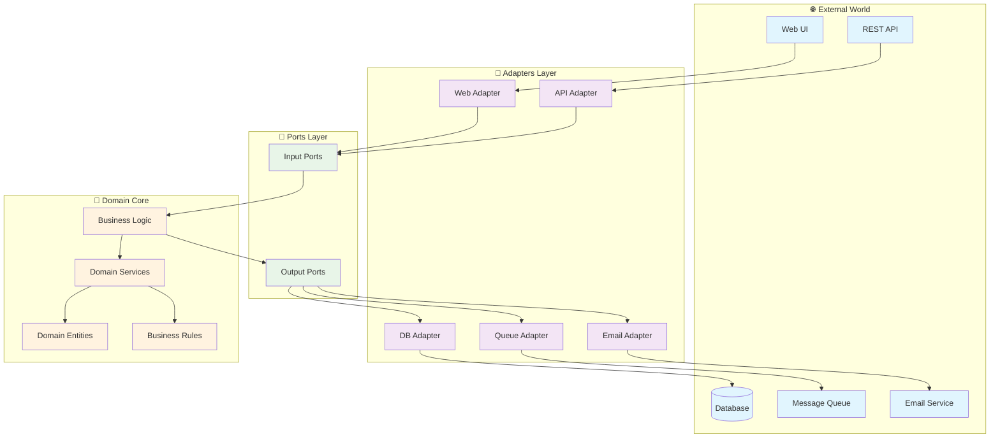

## 🏷️ Tags

#type/moc #concept/hexagonal-architecture #concept/ports-adapters #concept/clean-architecture #concept/dependency-inversion #area/architecture #tech/csharp #tech/asp-net #design-pattern/depe #status/active 

---

# MOC - Archeticture Patterns - Hexagonal Architecture

> [!abstract] 📋 Чек-лист изучения
> 
> - [ ] Понять основные принципы и философию паттерна
> - [ ] Изучить структуру: домен, порты, адаптеры
> - [ ] Освоить реализацию портов и адаптеров в .NET
> - [ ] Настроить DI контейнер для Hexagonal Architecture
> - [ ] Применить на практике с примерами кода
> - [ ] Изучить тестирование архитектуры
> - [ ] Понять отличия от других архитектурных паттернов

---

## 🎯 Что такое Hexagonal Architecture

**Hexagonal Architecture** (архитектура портов и адаптеров) — архитектурный паттерн, предложенный Алистером Кокберном, который изолирует бизнес-логику приложения от внешних зависимостей через систему **портов** и **адаптеров**.

> [!tip] ✨ Ключевая идея Приложение должно быть одинаково управляемо пользователями, программами, автоматизированными тестами или пакетными скриптами, а также разрабатываться и тестироваться в изоляции от внешних устройств и баз данных.

### 🔗 Основные принципы

1. **Изоляция домена** — бизнес-логика не зависит от внешних систем
2. **Обратная зависимость** — инфраструктура зависит от домена, а не наоборот
3. **Тестируемость** — домен можно тестировать без внешних зависимостей
4. **Гибкость** — легкая замена внешних систем без изменения домена

---

## 📚 Содержание

### 🏛️ Архитектурные основы

- [[Hexagonal Architecture - Структура и компоненты]] — детальный разбор архитектуры
- [[Hexagonal Architecture - Порты]] — интерфейсы взаимодействия с доменом
- [[Hexagonal Architecture - Адаптеры]] — реализации портов для внешних систем

### ⚙️ Реализация в .NET

- [[Hexagonal Architecture - Настройка проекта .NET]] — структура решения и проектов
- [[Hexagonal Architecture - Dependency Injection]] — настройка DI контейнера
- [[Hexagonal Architecture - Примеры кода]] — практические примеры реализации

### 🧪 Тестирование и качество

- [[Hexagonal Architecture - Тестирование]] — стратегии тестирования архитектуры
- [[Hexagonal Architecture - Мониторинг и логирование]] — наблюдаемость в гексагональной архитектуре

---

## 🏗️ Схема архитектуры



---

## 🆚 Сравнение с другими архитектурами

|Аспект|Hexagonal|Clean Architecture|N-Layer|
|---|---|---|---|
|**Зависимости**|Все направлены к домену|Все направлены к домену|Сверху вниз|
|**Тестируемость**|Высокая|Высокая|Средняя|
|**Сложность**|Средняя|Высокая|Низкая|
|**Гибкость**|Высокая|Высокая|Низкая|

---

## 🛠️ Быстрый старт

> [!example] 📝 Минимальная реализация
> 
> 1. **Создай структуру проекта**:
>     
>     ```
>     Solution/
>     ├── Domain/           # Бизнес-логика
>     ├── Application/      # Порты и use cases
>     ├── Infrastructure/   # Адаптеры
>     └── Presentation/     # Web API/UI
>     ```
>     
> 2. **Определи порты** (интерфейсы в Application)
>     
> 3. **Реализуй адаптеры** (в Infrastructure)
>     
> 4. **Настрой DI** для связывания портов и адаптеров
>     

---

## 📖 Связанные концепции

- [[Концепции (concept)#concept/dependency-inversion|Dependency Inversion Principle]]
- [[MOC - Clean Architcture|Clean Architecture]]
- [[DDD.Domain Service|DDD - Domain Service]]
- [[Dependency Injection]]
- [[SOLID Principles]]

---

> [!summary] 🎯 Итоги Hexagonal Architecture — мощный паттерн для создания гибких, тестируемых и независимых от инфраструктуры приложений. Особенно эффективен в .NET экосистеме благодаря встроенной поддержке DI и богатым возможностям тестирования.