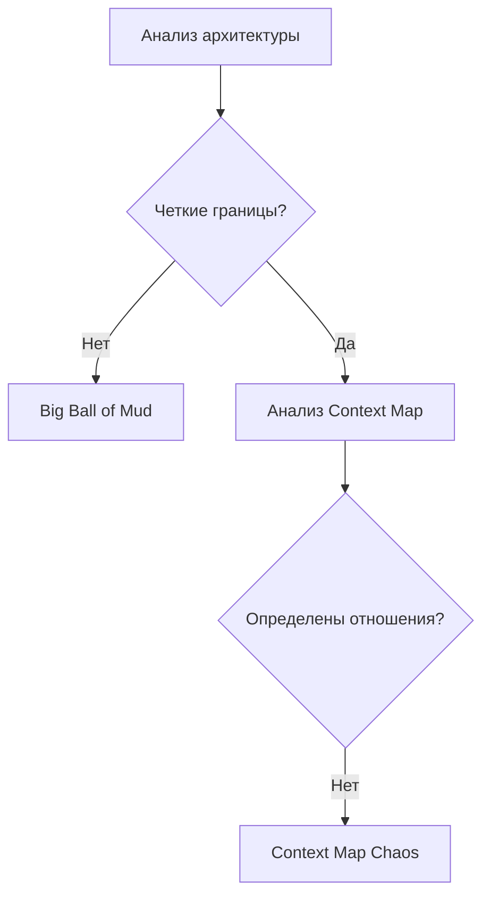
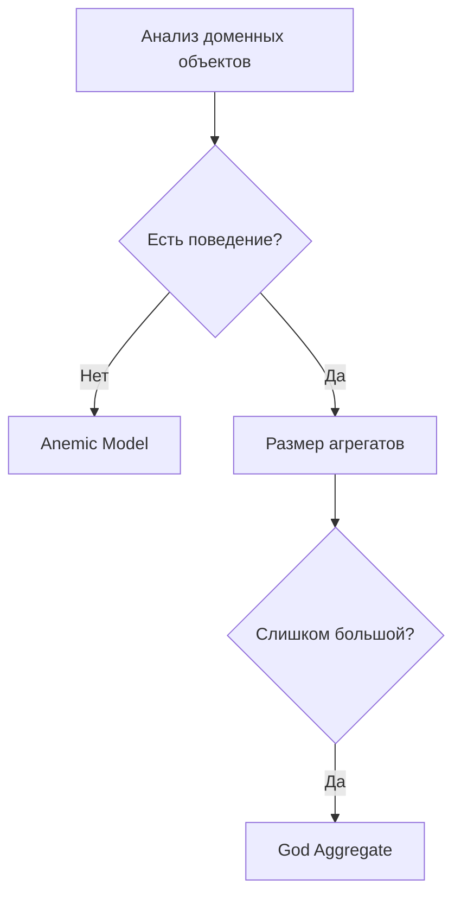

## 🏷️ Tags

#type/moc #concept/ddd #area/architecture #status/active 

---

# MOC - DDD - Anti-Patterns

> [!warning] 💡 О чем эта заметка Каталог основных антипаттернов в Domain-Driven Design, их признаки, последствия и способы избежания. Организован как Map of Content (MOC) для удобной навигации.

---

## 📋 Чек-лист: что будет раскрыто

- [ ] **Стратегические антипаттерны** - проблемы на уровне архитектуры
- [ ] **Тактические антипаттерны** - проблемы в моделировании домена
- [ ] **Технические антипаттерны** - проблемы реализации
- [ ] **Организационные антипаттерны** - проблемы процессов и команды
- [ ] **Способы диагностики** - как выявить антипаттерны
- [ ] **Рефакторинг** - как исправить найденные проблемы

---

## 🗺️ Карта содержания

### 🏗️ Стратегические Anti-Patterns

Проблемы на уровне архитектуры и разделения доменов

|Anti-Pattern|Описание|Риски|
|---|---|---|
|**Big Ball of Mud Domain**|Отсутствие четких границ между доменами|Сложность понимания, высокая связанность|
|**Generic Subdomain as Core**|Трактовка вспомогательных доменов как ключевых|Неэффективное распределение ресурсов|
|**Context Map Chaos**|Неопределенные отношения между контекстами|Проблемы интеграции, дублирование|

> [!tip] 📖 Подробнее [[Strategic Anti-Patterns]] - детальный разбор стратегических проблем

### ⚙️ Тактические Anti-Patterns

Проблемы в моделировании доменных объектов

|Anti-Pattern|Описание|Признаки|
|---|---|---|
|**Anemic Domain Model**|Объекты без бизнес-логики|Только геттеры/сеттеры, логика в сервисах|
|**God Aggregate**|Слишком крупные агрегаты|Низкая производительность, сложность|
|**Primitive Obsession**|Использование примитивов вместо Value Objects|Дублирование валидации, неясность|

> [!tip] 📖 Подробнее  
> [[Tactical Anti-Patterns]] - проблемы моделирования домена

### 🔧 Технические Anti-Patterns

Проблемы в реализации DDD концепций

| Anti-Pattern                      | Описание                                   | Последствия                       |
| --------------------------------- | ------------------------------------------ | --------------------------------- |
| **Repository as DAO**             | Репозиторий как простая обертка над БД     | Протекание инфраструктуры в домен |
| **Domain Services Everywhere**    | Избыточное использование доменных сервисов | Потеря инкапсуляции               |
| **Event Sourcing for Everything** | Применение ES везде без необходимости      | Неоправданная сложность           |

> [!tip] 📖 Подробнее [[MOC - DDD - Anti-Patterns|Anti-Patterns]] - проблемы реализации

### 👥 Организационные Anti-Patterns

Проблемы процессов и работы команды

|Anti-Pattern|Описание|Влияние|
|---|---|---|
|**Conway's Law Violation**|Структура системы не соответствует команде|Проблемы коммуникации|
|**Ivory Tower Architecture**|Архитектура без участия разработчиков|Нереализуемые решения|
|**Domain Expert Shortage**|Отсутствие экспертов домена|Неточная модель|

> [!tip] 📖 Подробнее [[Organizational Anti-Patterns]] - организационные проблемы

---

## 🔍 Методы диагностики

### Стратегический уровень

### Тактический уровень

---

## 🛠️ Стратегии рефакторинга

> [!example] 🎯 Пошаговый подход
> 
> 1. **Диагностика** - выявить антипаттерны через код-ревью и архитектурный анализ
> 2. **Приоритизация** - начать с самых критичных проблем
> 3. **Планирование** - разбить на итерации с минимальными рисками
> 4. **Рефакторинг** - применить паттерны DDD постепенно
> 5. **Валидация** - убедиться в улучшении метрик качества

---

## 🔗 Связанные концепции

- [[MOC - DDD - Bounded Context|Bounded Context]] - основа для избежания стратегических антипаттернов
- [[DDD.Aggregate|Aggregate]] - правильное моделирование для избежания God Aggregate
- [[DDD.ValueObject|Value Objects]] - решение Primitive Obsession
- [[DDD.Domain Service|Domain Service]] - когда использовать, а когда избегать
- [[DDD.Repository|Repository]] - корректная реализация репозитория
- [[DDD.EventStorming|Event Storming]] - техника выявления проблем в модели

---

## 📚 Дополнительные ресурсы

> [!info] 📖 Рекомендуемое чтение
> 
> - "Domain-Driven Design" by Eric Evans - оригинальная книга с паттернами
> - "Implementing Domain-Driven Design" by Vaughn Vernon - практические аспекты
> - "Domain Modeling Made Functional" by Scott Wlaschin - функциональный подход
> - "Learning Domain-Driven Design" by Vlad Khononov - современный взгляд

---

> [!warning] ⚠️ Важно помнить Антипаттерны - это не всегда критические ошибки. Иногда они могут быть оправданы контекстом проекта, временными ограничениями или особенностями команды. Главное - осознанный выбор архитектурных решений.