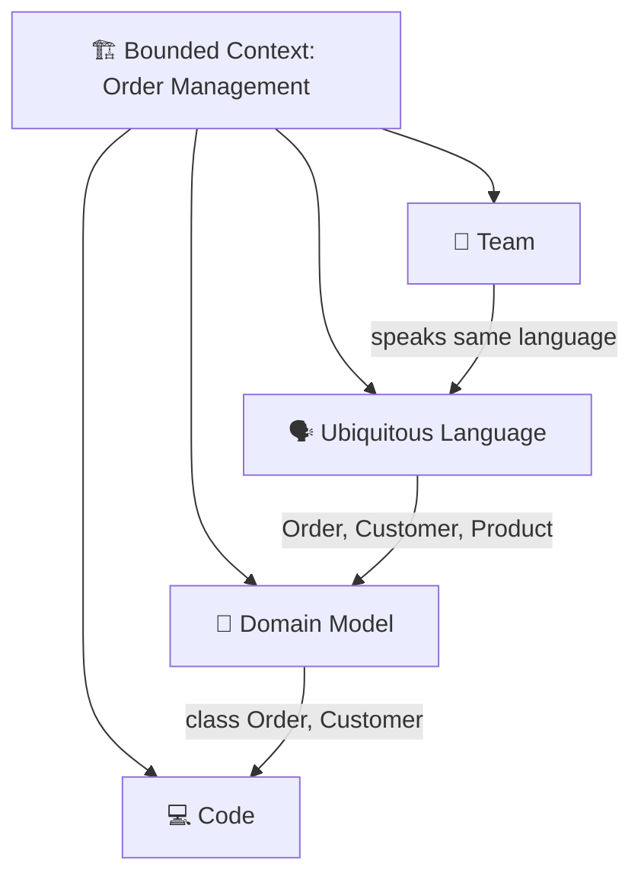
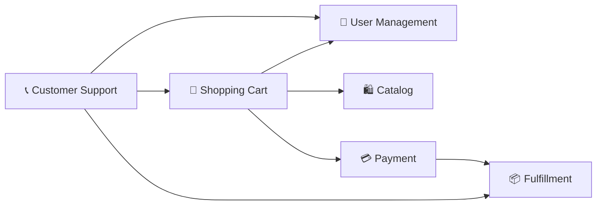
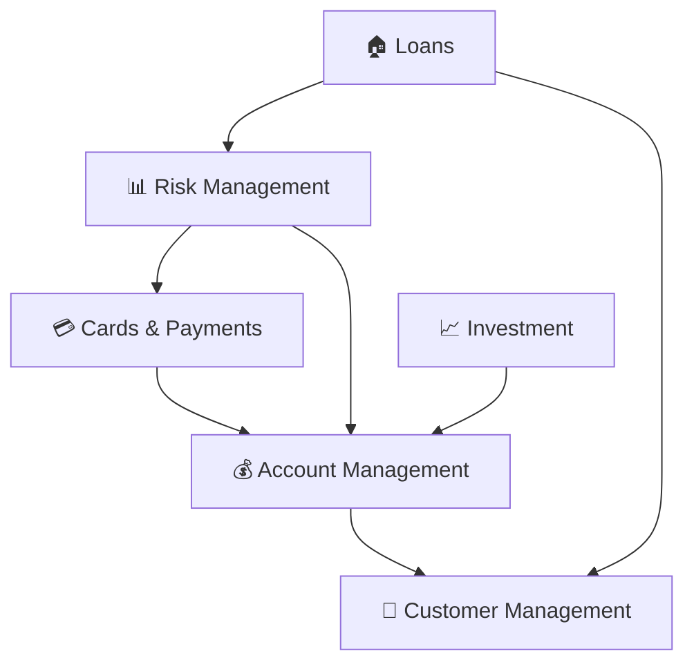

## 🏷️ Tags

#type/moc #concept/ddd #ddd/bounded-context #area/architecture #area/development #status/active 

---

# MOC - DDD - Bounded Context

> [!info] 📋 О концепции Bounded Context (Ограниченный контекст) — центральная концепция DDD, определяющая границы применимости единой модели предметной области и общего языка команды.

---

## ✅ Что изучим

- [x] Определение и суть Bounded Context
- [x] Принципы выделения контекстов
- [x] Типы отношений между контекстами
- [x] Паттерны интеграции
- [x] Практические примеры и рекомендации

---

## 📑 Оглавление

### 🎯 Основы

- [[#🔍 Определение]]
- [[#⚡ Ключевые принципы]]
- [[#🎨 Ubiquitous Language внутри контекста]]

### 🔗 Взаимодействие контекстов

- [[#🗺️ Context Map]]
- [[#🔄 Типы отношений между контекстами]]
- [[#🌉 Паттерны интеграции]]

### 💼 Практика

- [[#📝 Как выделить Bounded Context]]
- [[#🏢 Примеры из бизнеса]]
- [[#⚠️ Частые ошибки]]

---

## 🔍 Определение

> [!quote] Eric Evans "Bounded Context — это граница, внутри которой конкретная модель предметной области определена и применима."

**Bounded Context определяет:**

- 🎯 **Границы модели** — где конкретные концепции имеют четкое значение
- 🗣️ **Единый язык** — Ubiquitous Language команды разработки
- 👥 **Команду** — группу людей, работающих с одной моделью
- 🏗️ **Код** — реализацию модели в виде сервисов/модулей

---

## ⚡ Ключевые принципы

> [!tip] 🎯 Основные правила
> 
> 1. **Один контекст — одна модель**
> 2. **Явные границы** между контекстами
> 3. **Автономность** команд внутри контекста
> 4. **Controlled integration** между контекстами

|Принцип|Описание|Пример|
|---|---|---|
|**Model Integrity**|Модель целостна внутри границ|`User` в контексте "Аутентификация" ≠ `User` в "Продажах"|
|**Team Autonomy**|Команда владеет своим контекстом|Команда может изменять модель без согласования|
|**Clear Boundaries**|Границы явно определены|API, события, общие библиотеки|

---

## 🎨 Ubiquitous Language внутри контекста

Внутри Bounded Context действует **единый язык** всех участников:



**Примеры терминологии в разных контекстах:**

| Термин       | В контексте "Sales"           | В контексте "Shipping" | В контексте "Support" |
| ------------ | ----------------------------- | ---------------------- | --------------------- |
| **Customer** | Покупатель с историей заказов | Получатель посылки     | Клиент с тикетами     |
| **Order**    | Коммерческая сделка           | Задание на доставку    | Предмет жалобы        |
| **Product**  | Товар с ценой                 | Товар с габаритами     | Товар с гарантией     |

---

## 🗺️ Context Map

> [!info] 📋 Context Map Стратегическая карта, показывающая все Bounded Contexts и отношения между ними.
> 
> **Подробнее**: [[DDD.Context Map| Context Map]]

**Зачем нужна Context Map:**

- 🎯 Видеть всю систему целиком
- 🔄 Понимать взаимодействия между командами
- ⚠️ Выявлять проблемные интеграции
- 📈 Планировать эволюцию архитектуры

---

## 🔄 Типы отношений между контекстами

> [!note] 🔗 Основные паттерны отношений
> 
> **Подробнее**: [[MOC - DDD - Context Relations| Context Relations]] 

### Partnership 🤝

**Равноправное сотрудничество**

```
[Sales Context] ←→ [Marketing Context]
```

- Команды координируют изменения
- Общие релизы и планирование

### Shared Kernel 🌰

**Общее ядро**

```
[Online Store] ←→ [Mobile App]
      ↓
  [Shared Models]
```

- Общие модели и код
- Требует тесной координации

### Customer/Supplier 🔄

**Поставщик/Потребитель**

```
[User Management] → [Order Processing]
     (Supplier)        (Customer)
```

- Supplier определяет контракт
- Customer адаптируется к изменениям

### Conformist 😔

**Конформист**

```
[Our System] → [Legacy/External System]
```

- Принимаем модель внешней системы
- Минимальная интеграция

### Anti-Corruption Layer 🛡️

**Анти-коррупционный слой**

```
[Our Domain] ← [ACL] ← [Legacy System]
```

- Защищаем свою модель от внешней
- Трансляция между моделями

---

## 🌉 Паттерны интеграции

> [!tip] 🔧 Способы интеграции контекстов

### 1. **Shared Database** 🗄️

```sql
-- Общая таблица users
[Context A] ← [Shared DB] → [Context B]
```

**❌ Минусы:** Сильная связанность, сложность изменений

### 2. **Database Integration** 📊

```sql
[Context A] → [Database A] 
                    ↓ (read-only)
              [Context B]
```

**⚠️ Осторожно:** Нарушение инкапсуляции

### 3. **File Transfer** 📁

```
[Context A] → [CSV/JSON] → [Context B]
```

**✅ Подходит для:** Batch-процессы, отчетность

### 4. **Remote Procedure Call** 📞

```
[Context A] --REST/gRPC--> [Context B]
```

**✅ Синхронное** взаимодействие

### 5. **Messaging** 📧

```
[Context A] → [Event Bus] → [Context B]
```

**✅ Асинхронное** взаимодействие, слабая связанность

---

## 📝 Как выделить Bounded Context

> [!warning] 🎯 Пошаговый подход

### 1. **Анализ предметной области** 🔍

- Проведите [[DDD.EventStorming|Event Storming]] 
- Найдите ключевые бизнес-процессы
- Выявите разные значения одинаковых терминов

### 2. **Критерии выделения контекста** ⚡

|Критерий|Вопросы для анализа|
|---|---|
|**Язык**|Используют ли разные команды разные определения одного термина?|
|**Данные**|Нужны ли разным командам разные представления одной сущности?|
|**Процессы**|Есть ли независимые бизнес-процессы?|
|**Команды**|Могут ли команды работать автономно?|
|**Изменения**|Изменяются ли разные части системы с разной скоростью?|

### 3. **Размер контекста** 📏

> [!info] 🎯 Правило размера
> 
> - **👥 Команда:** 2-8 человек (правило пиццы Amazon)
> - **📦 Сервисы:** 1-5 микросервисов на контекст
> - **📝 Код:** ~100,000 строк кода максимум
> - **🏗️ Модель:** 5-20 основных сущностей

---

## 🏢 Примеры из бизнеса

### E-commerce система 🛒



**Контексты:**

- **User Management** — регистрация, профили, аутентификация
- **Catalog** — товары, категории, поиск, рекомендации
- **Shopping Cart** — корзина, wishlist, промокоды
- **Payment** — платежи, биллинг, возвраты
- **Fulfillment** — заказы, доставка, склад
- **Customer Support** — тикеты, чаты, FAQ

### Банковская система 🏦



---

## ⚠️ Частые ошибки

> [!danger] 🚨 Анти-паттерны

### 1. **Слишком крупные контексты** 🐘

```
❌ [Monolithic Business Context]
   ├── Users, Orders, Products, 
   ├── Payments, Shipping, Support,
   └── Analytics, Reporting...
```

**Проблема:** Команды блокируют друг друга

### 2. **Слишком мелкие контексты** 🐭

```
❌ [User Context] [Address Context] [Email Context]
```

**Проблема:** Overhead на интеграцию

### 3. **Shared Database как интеграция** 🗄️

```
❌ [Service A] ←→ [Shared DB] ←→ [Service B]
```

**Проблема:** Сильная связанность через данные

### 4. **Игнорирование Conway's Law** 👥

```
❌ 1 команда → 3 контекста
❌ 3 команды → 1 контекст  
```

**Помните:** Архитектура отражает структуру команд

---

## 🔗 Связанные концепции

### Следующие шаги для изучения:

- [[DDD.Context Map|Context Map]] — стратегическое планирование
- [[MOC - DDD - Context Relations|Context Relations]] — типы отношений детально
- [[DDD.Anti-CorruptionLayer|Anti-Corruption Layer]] — защита от внешних систем
- [[DDD - Shared Kernel]] — управление общим кодом
- [[DDD.EventStorming|Event Storming]] — техника выявления контекстов
- [[DDD.UbiquitousLanguage]] — единый язык команды

### Паттерны архитектуры:

- [[MOC - Microservices|Microservices]] — реализация через сервисы
- [[API Gateway]] — единая точка входа
- [[Arch.Event-Driven]] — интеграция через события

---

## 📚 Рекомендуемые материалы

> [!info] 📖 Для изучения
> 
> **Книги:**
> 
> - Eric Evans — "Domain-Driven Design"
> - Vaughn Vernon — "Implementing Domain-Driven Design"
> - Alberto Brandolini — "Introducing EventStorming"
> 
> **Статьи:**
> 
> - Martin Fowler — "BoundedContext"
> - Context Mapping by Brandolini
