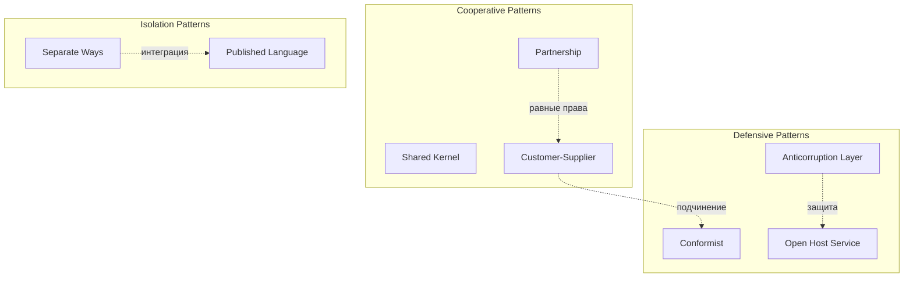

## 🏷️ Tags

#type/moc #area/architecture #concept/ddd #ddd/context-map #ddd/integration-patterns #ddd/context-relations #ddd/strategic-design #status/active 

---

# MOC - DDD - Context Relations

> [!info] 📋 Краткое описание Комплексное руководство по отношениям между Bounded Context'ами в Domain-Driven Design. Рассматривает паттерны интеграции, стратегические подходы к взаимодействию контекстов и практические аспекты реализации.

---

## 🎯 Что будет раскрыто

- [ ] **Основы Context Relations** — базовые концепции и принципы
- [ ] **Стратегические паттерны** — Partnership, Shared Kernel, Customer-Supplier
- [ ] **Тактические паттерны** — Conformist, Anticorruption Layer, Open Host Service
- [ ] **Паттерны изоляции** — Separate Ways, Published Language
- [ ] **Context Map** — визуализация и документирование отношений
- [ ] **Практические аспекты** — выбор паттернов, эволюция отношений
- [ ] **Примеры реализации** — код и архитектурные решения

---

## 📑 Оглавление

### 🏗️ Основы

- [[DDD Context Relations - Основы|Основы Context Relations]] — принципы, классификация, Context Map
- [[DDD Context Relations - Стратегические решения|Стратегические решения]] — выбор типа отношений

### 🤝 Паттерны сотрудничества

- [[DDD Context Relations - Partnership|Partnership]] — равноправное партнерство
- [[DDD Context Relations - Shared Kernel|Shared Kernel]] — общее ядро
- [[DDD Context Relations - Customer Supplier|Customer-Supplier]] — поставщик-потребитель

### 🛡️ Паттерны защиты

- [[DDD Context Relations - Conformist|Conformist]] — конформизм
- [[DDD Context Relations - Anticorruption Layer|Anticorruption Layer]] — антикоррупционный слой
- [[DDD Context Relations - Open Host Service|Open Host Service]] — открытый хост-сервис

### 🚪 Паттерны изоляции

- [[DDD Context Relations - Separate Ways|Separate Ways]] — раздельные пути
- [[DDD Context Relations - Published Language|Published Language]] — опубликованный язык

### 📊 Документирование и управление

- [[DDD.Context Map|Context Map]] — создание карты контекстов
- [[DDD Context Relations - Evolution|Эволюция отношений]] — изменение паттернов со временем

---

## 🔍 Быстрый справочник

> [!example]- 📋 Матрица выбора паттернов
> 
> |Ситуация|Рекомендуемый паттерн|Альтернатива|
> |---|---|---|
> |Одна команда, тесная связь|**Shared Kernel**|Partnership|
> |Разные команды, общие цели|**Partnership**|Customer-Supplier|
> |Четкая иерархия|**Customer-Supplier**|Conformist|
> |Внешние системы|**Anticorruption Layer**|Open Host Service|
> |Независимые домены|**Separate Ways**|Published Language|

> [!warning]- ⚠️ Антипаттерны
> 
> - **Big Ball of Mud** — отсутствие четких границ между контекстами
> - **Shared Database** — прямое взаимодействие через БД без абстракций
> - **Chatty Integration** — слишком частые синхронные вызовы
> - **God Context** — один контекст знает обо всех остальных

---

## 🎨 Визуализация отношений

---

## 🔗 Связанные концепции

- [[MOC - DDD - Bounded Context|Bounded Context]] — основа для Context Relations
- [[DDD.UbiquitousLanguage]] — влияет на выбор паттернов интеграции
- [[DDD.EventStorming|Event Storming]] — помогает выявить границы контекстов
- [[Microservices Architecture]] — практическая реализация Context Relations
- [[API Gateway Pattern]] — техническая реализация Open Host Service

---

## 📚 Дополнительные материалы

> [!tip]- 📖 Рекомендуемая литература
> 
> - Eric Evans "Domain-Driven Design" (Chapter 14: Maintaining Model Integrity)
> - Vaughn Vernon "Implementing Domain-Driven Design" (Chapter 3: Context Maps)
> - Alberto Brandolini "Introducing EventStorming"
> - Sam Newman "Building Microservices" (Chapter 1: What Are Microservices?)

> [!example]- 🛠️ Инструменты
> 
> - **Context Mapper** — DSL для создания Context Map
> - **Miro/Mural** — визуализация отношений между контекстами
> - **PlantUML** — диаграммы архитектуры
> - **EventStorming Tools** — выявление границ контекстов

---

