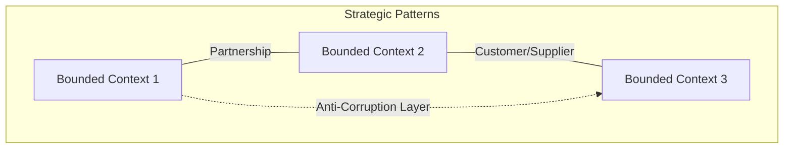
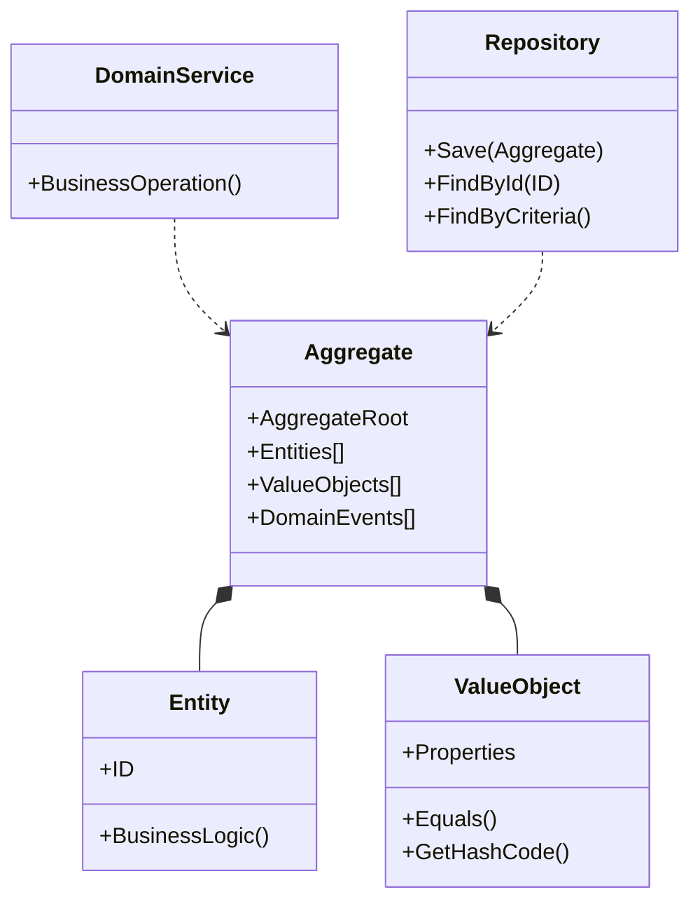
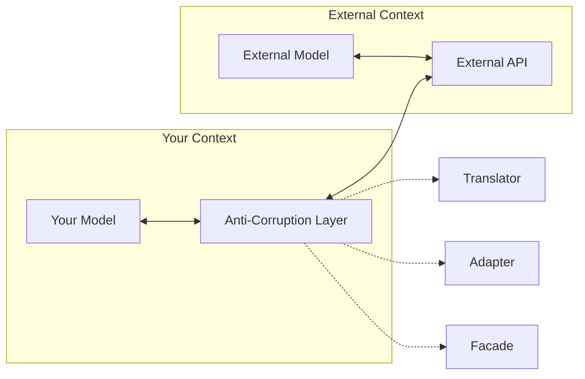
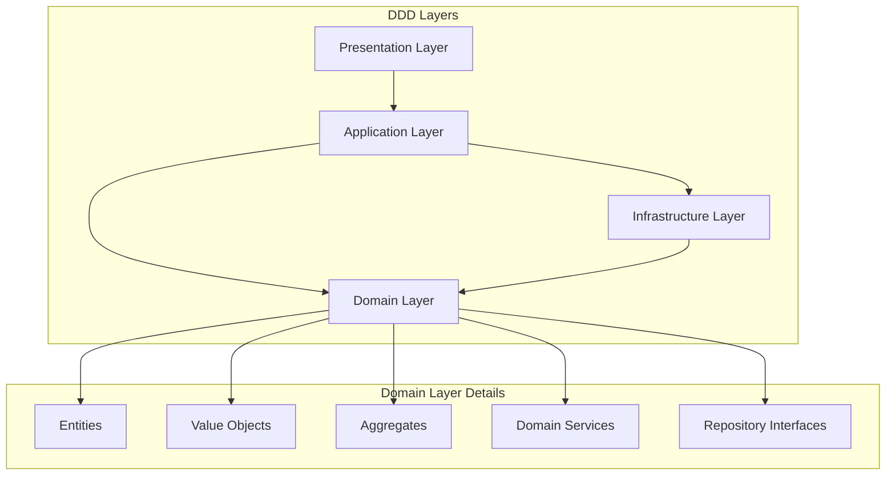
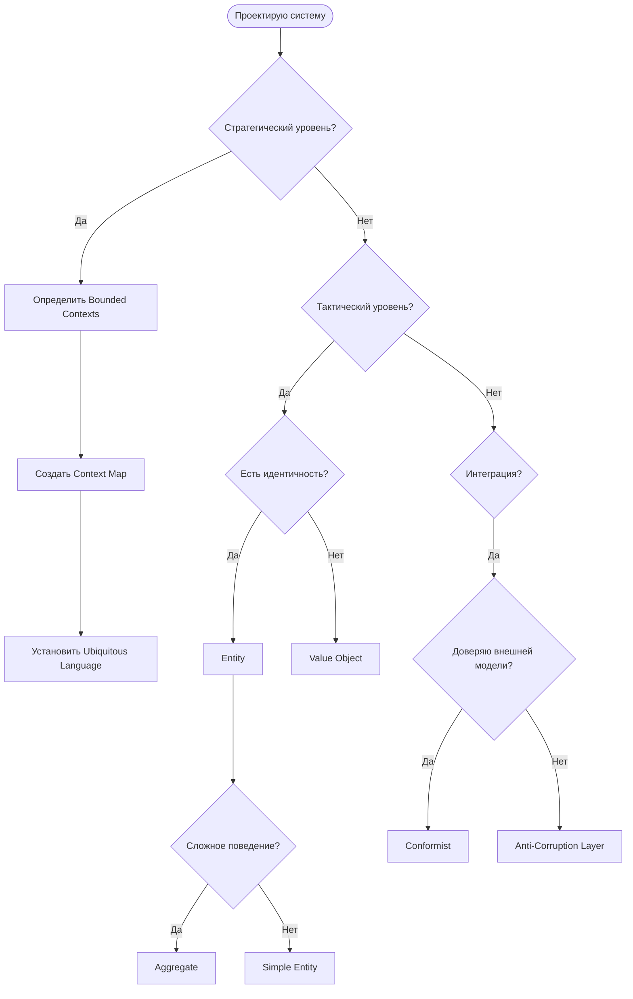

## 🏷️ Tags

#type/moc #concept/ddd #area/architecture #area/development #status/active 

---

# MOC - DDD - Patterns Cheatsheet

> [!info] 📋 О заметке Центральный справочник по паттернам Domain-Driven Design с быстрым доступом к ключевым концепциям и их практическому применению

---

## ✅ Что будет раскрыто

- [ ] **Strategic Patterns** — стратегические паттерны для моделирования доменов
- [ ] **Tactical Patterns** — тактические паттерны для реализации
- [ ] **Integration Patterns** — паттерны интеграции между контекстами
- [ ] **Infrastructure Patterns** — инфраструктурные паттерны
- [ ] **Anti-Patterns** — что следует избегать
- [ ] **Quick Reference** — быстрая справка по применению
- [ ] **Code Examples** — примеры реализации

---

## 📑 Содержание

### 🎯 Strategic Design Patterns

### ⚙️ Tactical Design Patterns

### 🔗 Integration Patterns

### 🏗️ Infrastructure Patterns

### ⚠️ Anti-Patterns & Pitfalls

### 📖 Quick Reference Guide

---

## 🎯 Strategic Design Patterns

> [!tip] 💡 Стратегические паттерны Помогают структурировать домен на высоком уровне и определить границы между различными частями системы

### 📊 Обзор стратегических паттернов

| Паттерн                                              | Цель                                     | Когда использовать                  |
| ---------------------------------------------------- | ---------------------------------------- | ----------------------------------- |
| **[[MOC - DDD - Bounded Context\|Bounded Context]]** | Явное определение границ модели          | Всегда - основа DDD                 |
| **[[DDD.SubdomainTypes\|🎯 Subdomain Types]]**    | Разделение бизнес-области                | При сложной предметной области      |
| **[[DDD.Context Map\|Context Map]]**               | Визуализация отношений между контекстами | При множественных командах/системах |
| **[[Ubiquitous Language]]**                          | Единый язык команды                      | Всегда - основа коммуникации        |

### 🗺️ Context Relationships



---

## ⚙️ Tactical Design Patterns

> [!gear] 🔧 Тактические паттерны Конкретные строительные блоки для реализации доменной модели

### 📋 Building Blocks

| Паттерн                                      | Ответственность             | Характеристики                     |
| -------------------------------------------- | --------------------------- | ---------------------------------- |
| **[[DDD.Entity\|Entity]]**                 | Объекты с идентичностью     | Изменяемые, уникальный ID          |
| **[[DDD.ValueObject\|Value Object]]**     | Описательные объекты        | Неизменяемые, без ID               |
| **[[DDD.Aggregate\|Aggregate]]**           | Границы консистентности     | Корень + внутренние объекты        |
| **[[DDD.Domain Service\|Domain Service]]** | Бизнес-логика без состояния | Операции над несколькими объектами |
| **[[DDD.Repository\|Repository]]**         | Доступ к агрегатам          | Инкапсуляция хранилища             |
| **[[Factory]]**                              | Создание сложных объектов   | Скрытие логики конструирования     |

### 🏗️ Tactical Patterns Structure



---

## 🔗 Integration Patterns

> [!link] 🌐 Интеграционные паттерны Способы взаимодействия между Bounded Context'ами

### 🔄 Context Integration

| Паттерн                                                        | Описание                   | Плюсы                | Минусы                   |
| -------------------------------------------------------------- | -------------------------- | -------------------- | ------------------------ |
| **[[Shared Kernel]]**                                          | Общая модель               | Простота             | Сильная связанность      |
| **[[Customer-Supplier]]**                                      | Отношения поставщик-клиент | Четкие обязательства | Зависимость              |
| **[[Conformist]]**                                             | Принятие чужой модели      | Быстрая интеграция   | Потеря автономии         |
| **[[DDD.Anti-CorruptionLayer\|🛡️ Anti-Corruption Layer]]** | Защитный слой              | Изоляция изменений   | Дополнительная сложность |
| **[[Open Host Service]]**                                      | Публичный API              | Стандартизация       | Необходимость поддержки  |
| **[[Published Language]]**                                     | Общий формат данных        | Универсальность      | Сложность эволюции       |

### 🛡️ Anti-Corruption Layer Pattern



---

## 🏗️ Infrastructure Patterns

> [!wrench] 🔧 Инфраструктурные паттерны Технические паттерны для поддержки доменной модели

### 📦 Implementation Patterns

|Паттерн|Назначение|Реализация|
|---|---|---|
|**[[Domain Events]]**|Уведомления о бизнес-событиях|Event-driven архитектура|
|**[[Specification]]**|Бизнес-правила как объекты|Композиция условий|
|**[[Unit of Work]]**|Управление транзакциями|Отслеживание изменений|
|**[[Data Transfer Object]]**|Передача данных между слоями|Сериализуемые структуры|

### 🎭 Layered Architecture



---

## ⚠️ Anti-Patterns & Pitfalls

> [!warning] 🚫 Что избегать Распространенные ошибки при применении DDD

### 💀 Common Anti-Patterns

|Anti-Pattern|Описание|Почему плохо|Решение|
|---|---|---|---|
|**Anemic Domain Model**|Модель без поведения|Нарушение инкапсуляции|Перенести логику в Entity|
|**Big Ball of Mud**|Отсутствие границ|Сложность сопровождения|Выделить Bounded Context|
|**God Object**|Один объект делает все|Нарушение SRP|Декомпозиция|
|**Primitive Obsession**|Примитивы вместо VO|Потеря семантики|Создать Value Objects|

### 🔍 Code Smells в DDD

```csharp
// ❌ Anti-Pattern: Anemic Domain Model
public class User
{
    public string Email { get; set; }
    public string Password { get; set; }
    public bool IsActive { get; set; }
}

public class UserService 
{
    public void ActivateUser(User user) 
    {
        user.IsActive = true; // Логика в сервисе
    }
}

// ✅ Rich Domain Model  
public class User
{
    public Email Email { get; private set; }
    public Password Password { get; private set; }
    public bool IsActive { get; private set; }
    
    public void Activate() 
    {
        IsActive = true; // Логика в модели
        // Бизнес-правила активации
    }
}
```

---

## 📖 Quick Reference Guide

> [!reference] 📚 Быстрая справка Когда использовать какой паттерн

### 🎯 Decision Matrix



### 📋 Pattern Selection Checklist

- [ ] **Bounded Context** - всегда первый шаг
- [ ] **Aggregate** - для группировки связанных Entity
- [ ] **Value Object** - для описательных характеристик
- [ ] **Domain Service** - для операций над несколькими Aggregates
- [ ] **Repository** - для доступа к данным
- [ ] **Anti-Corruption Layer** - при интеграции с legacy системами

---

## 🔗 Связанные заметки

### 📚 Детальное изучение

- [[DDD Strategic Design]] - стратегическое проектирование
- [[DDD Tactical Patterns]] - тактические паттерны
- [[DDD Implementation Examples]] - примеры реализации
- [[DDD Best Practices]] - лучшие практики

### 🛠️ Практическое применение

- [[DDD with .NET]] - реализация на .NET
- [[DDD Testing Strategies]] - стратегии тестирования
- [[DDD Migration Guide]] - миграция к DDD

### 🔄 Связанные концепции

- [[Clean Architecture]] - архитектурные принципы
- [[CQRS]] - разделение команд и запросов
- [[ArchPat.EventSourcing]] - событийное хранилище
- [[Microservices]] - микросервисная архитектура

---

> [!tip] 💡 Следующие шаги
> 
> 1. Изучите [[MOC - DDD - Bounded Context|Bounded Context]] как основу DDD
> 2. Освойте [[Aggregate Pattern]] для моделирования
> 3. Примените [[Repository Pattern]] для персистентности
> 4. Рассмотрите [[DDD.Anti-CorruptionLayer]] для интеграций