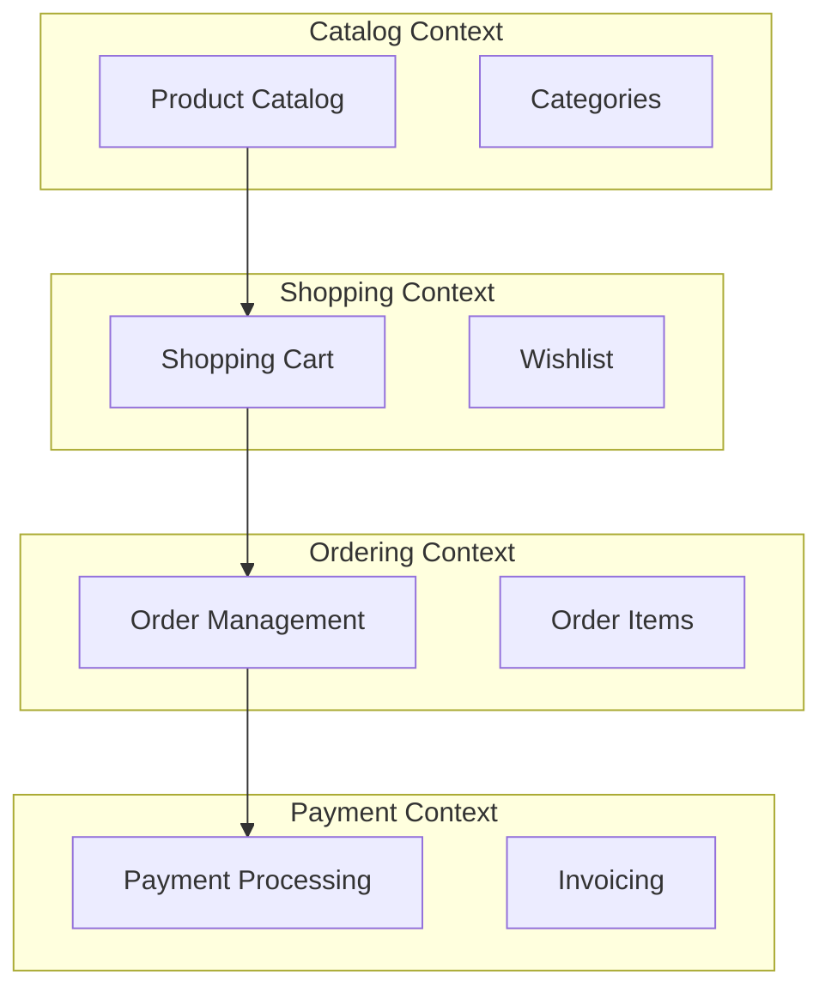

## 🏷️ Tags

#type/moc #area/architecture #concept/ddd #ddd/bounded-context #ddd/aggregate #ddd/strategic-design #status/active 

---

# MOC - DDD - Sample Applications

> [!info] 📋 О заметке Коллекция практических примеров применения Domain-Driven Design в различных типах приложений и доменах

---

## ✅ Что будет раскрыто

- [ ] Обзор типов sample applications для DDD
- [ ] Классические примеры доменов
- [ ] Современные архитектурные подходы
- [ ] Интеграционные паттерны между контекстами
- [ ] Ресурсы и репозитории с примерами
- [ ] Критерии выбора подходящего примера
- [ ] Эволюция архитектуры в примерах

---

## 📑 Оглавление

1. [[#🎯 Классические домены для DDD]]
2. [[#🏪 E-Commerce примеры]]
3. [[#🏦 Финансовые системы]]
4. [[#🏥 Healthcare приложения]]
5. [[#🎮 Gaming платформы]]
6. [[#📚 Ресурсы и репозитории]]
7. [[#⚖️ Критерии выбора примера]]

---

## 🎯 Классические домены для DDD

> [!tip] ✨ Почему эти домены популярны
> 
> - **Сложная бизнес-логика** - есть что моделировать
> - **Множественные контексты** - естественное разделение
> - **Понятные stakeholders** - легко проводить knowledge crunching

### 📊 Сравнительная таблица доменов

|Домен|Сложность|Bounded Contexts|Основные Aggregates|
|---|---|---|---|
|E-Commerce|⭐⭐⭐|Catalog, Cart, Order, Payment, Shipping|Product, Order, Customer|
|Banking|⭐⭐⭐⭐⭐|Account, Transfer, Loan, Risk|Account, Transaction, Customer|
|Healthcare|⭐⭐⭐⭐|Patient, Treatment, Billing|Patient, Appointment, Treatment|
|Insurance|⭐⭐⭐⭐|Policy, Claims, Underwriting|Policy, Claim, Customer|

---

## 🏪 E-Commerce примеры

> [!example] Популярные реализации
> 
> - **NorthWind Traders** - классический пример от Microsoft
> - **eShop on Containers** - современный микросервисный подход
> - **Modular Monolith Shop** - пример modular monolith

### Типичная архитектура E-Commerce



### Ключевые особенности

- **Product Catalog** - отдельный read-only контекст
- **Shopping Cart** - session-based aggregate
- **Order Processing** - saga pattern для координации
- **Payment** - интеграция с внешними системами

---

## 🏦 Финансовые системы

> [!warning] ⚠️ Высокая сложность Финансовые системы требуют особого внимания к consistency, auditability и compliance

### Banking Application Structure

|Bounded Context|Основная ответственность|Key Aggregates|
|---|---|---|
|Account Management|Управление счетами|Account, Customer|
|Transaction Processing|Обработка транзакций|Transaction, Transfer|
|Risk Assessment|Оценка рисков|RiskProfile, Limit|
|Regulatory Reporting|Отчётность|Report, Audit|

### Особенности реализации

- **Event Sourcing** для audit trail
- **CQRS** для разделения read/write
- **Saga Pattern** для сложных бизнес-процессов
- **Anti-Corruption Layer** для legacy интеграций

---

## 🏥 Healthcare приложения

### Hospital Management System

```
Patient Management Context
├── Patient Registration
├── Medical History
└── Insurance Verification

Clinical Context
├── Appointments
├── Treatments
└── Prescriptions

Billing Context
├── Insurance Claims
├── Payment Processing
└── Financial Reporting
```

### Критические аспекты

- **Privacy & Security** (HIPAA compliance)
- **Data Integrity** - медицинские данные критичны
- **Integration** - множество внешних систем
- **Audit Trail** - полная история изменений

---

## 🎮 Gaming платформы

> [!note] 🎯 Современный тренд Gaming платформы отлично подходят для демонстрации event-driven архитектуры

### Game Platform Contexts

|Context|Описание|Events|
|---|---|---|
|Player Management|Профили игроков|PlayerRegistered, PlayerUpdated|
|Game Session|Игровые сессии|GameStarted, GameEnded|
|Leaderboard|Рейтинги|ScoreSubmitted, RankingUpdated|
|Achievements|Достижения|AchievementUnlocked|

---

## 📚 Ресурсы и репозитории

### 🔥 Рекомендуемые репозитории

> [!resources] 📖 Лучшие источники
> 
> **Microsoft Examples:**
> 
> - [eShopOnContainers](https://github.com/dotnet-architecture/eShopOnContainers) - .NET микросервисы
> - [eShopOnWeb](https://github.com/dotnet-architecture/eShopOnWeb) - монолитный ASP.NET Core
> 
> **Community Examples:**
> 
> - [Modular Monolith](https://github.com/kgrzybek/modular-monolith-with-ddd) - отличный пример от Kamil Grzybek
> - [DDD Sample](https://github.com/citerus/dddsample-core) - классический cargo shipping пример
> 
> **Modern Approaches:**
> 
> - [Event Store samples](https://github.com/EventStore/EventStore) - Event Sourcing примеры
> - [Axon Framework samples](https://github.com/AxonFramework/AxonFramework) - CQRS/ES на Java

### Типы архитектур в примерах

|Архитектура|Подходит для|Примеры|
|---|---|---|
|**Monolith**|Малые-средние проекты|eShopOnWeb|
|**Modular Monolith**|Средние проекты|Modular Monolith Sample|
|**Microservices**|Крупные distributed системы|eShopOnContainers|
|**Event-Driven**|Высоконагруженные системы|Event Store samples|

---

## ⚖️ Критерии выбора примера

### Для изучения DDD

> [!success] ✅ Рекомендации по выбору
> 
> **Новичкам:**
> 
> - Начните с **Cargo Shipping** - классика жанра
> - Простой домен, понятная логика
> 
> **Для практики:**
> 
> - **E-Commerce** - много контекстов, реальные задачи
> - **Banking** - сложная логика, compliance требования
> 
> **Для production:**
> 
> - **Modular Monolith** - хороший старт
> - **Microservices** - при наличии expertise

### Матрица сложности vs полезности

```
Высокая полезность ↑
                   │
    Banking        │  Healthcare
                   │
                   │
    E-Commerce     │  Cargo Shipping
                   │
    Gaming         │  Blog/CMS
                   │
───────────────────┼─────────────→
                   │         Высокая сложность
    Simple Apps    │
                   │
```

---

## 🔄 Эволюция архитектуры в примерах

### Типичный путь развития

> [!timeline] 📈 Эволюция DDD приложения
> 
> **Phase 1: Monolith First**
> 
> - Один bounded context
> - Простая архитектура
> - Focus на domain modeling
> 
> **Phase 2: Modular Monolith**
> 
> - Выделение bounded contexts
> - Модульная структура
> - Internal integration patterns
> 
> **Phase 3: Distributed Monolith**
> 
> - Микросервисная архитектура
> - Event-driven communication
> - Distributed data management

### Критические моменты перехода

|Переход|Триггеры|Challenges|
|---|---|---|
|Monolith → Modular|Рост команды, сложность домена|Context boundaries|
|Modular → Microservices|Масштабирование, независимость команд|Data consistency, Integration|

---

## 🔗 Связанные заметки

- [[DDD]] - основные концепции Domain-Driven Design
- [[MOC - DDD - Bounded Context|Bounded Context]] - выделение контекстов в приложениях
- [[DDD.EventStorming]] - техника моделирования доменов
- [[DDD.Context Map]] - паттерны интеграции между контекстами
- [[Clean Architecture]] - архитектурные принципы
- [[Microservices Architecture]] - микросервисный подход

---

## 📝 Заметки для развития

> [!todo] 🎯 Планы по расширению
> 
> - [ ] Добавить детальный разбор eShopOnContainers
> - [ ] Создать сравнительный анализ архитектурных решений
> - [ ] Добавить примеры code snippets
> - [ ] Расширить раздел по Event Sourcing примерам
